# Charton - A versatile plotting library for Rust
**Altair-style declarative plotting for Rust. High-performance, Polars-native, and Wasm-ready.**

[](https://crates.io/crates/charton)
[](https://docs.rs/charton)
[](https://github.com/wangjiawen2013/charton/actions)
[](LICENSE)

**Charton** is a powerful, **Open Core** plotting library for Rust that provides first-class, native support for **[Polars]**(https://github.com/pola-rs/polars), and offers an API similar to Python's **[Altair]**(https://altair-viz.github.io/), making it easy for users familiar with declarative, instruction-based plotting to migrate. It also allows you to leverage existing mature visualization ecosystems, such as Altair and **[Matplotlib]**(https://matplotlib.org). By seamlessly integrating with **[evcxr_jupyter]**(https://github.com/evcxr/evcxr), Charton facilitates the creation of informative and aesthetically pleasing visualizations interactively, making it especially well-suited for exploratory data analysis.

## 🌟 Who Charton is For?
- **Data Scientists:** Generate visualizations directly in Rust after data processing-no more context-switching to Python.
- **Performance-sensitive scenarios:** Pure Rust rendering with no external dependencies, perfect for server-side batch generation.
- **Interactive Explorers:** Rapidly iterate on visualization logic via `evcxr` in Jupyter Notebooks.
- **WebAssembly Developers:** Bring Polars-powered data processing to the browser with a compact, web-optimized binary.

## Installation
Charton includes a pure-Rust SVG renderer, which allows users to create visualizations entirely in Rust without any external dependencies. To use charton, simply add it into `Cargo.toml`:
```
[dependencies]
charton = "0.2.0"
polars = "0.49.1"
```

## Quick Start (Rust-Native)
Charton employs a multi-layer plotting architecture, in which multiple layers are rendered within a shared coordinate system.  

For most use cases involving single-layer charts, Charton provides a streamlined interface. The `.into_layered()` method allows you to convert a single chart layer directly into a complete, renderable chart.
```rust
use charton::prelude::*;
use polars::prelude::*;
use std::error::Error;

fn main() -> Result<(), Box<dyn Error>> {
    // Create a polars dataframe
    let df = df![
        "length" => [5.1, 4.9, 4.7, 4.6, 5.0, 5.4, 4.6, 5.0, 4.4, 4.9],
        "width" => [3.5, 3.0, 3.2, 3.1, 3.6, 3.9, 3.4, 3.4, 2.9, 3.1]
    ]?;

    // Create a layer
    Chart::build(&df)?
        .mark_point()               // Scatter plot
        .encode((
            x("length"),            // Map length column to X-axis
            y("width"),             // Map width column to Y-axis
        ))?
        .into_layered()             // Create a layered chart
        .save("./scatter.svg")?;

    Ok(())
}
```
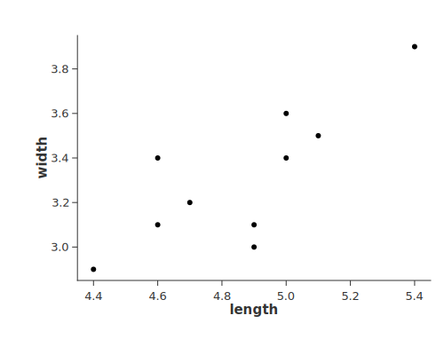
> 💡 Tip: `Chart::build(...)...into_layered()` is the most concise way to create and save single-layer visualizations.

**Explicit form**: The code above is equivalent to the following explicit construction using LayeredChart. Use this form when you need to combine multiple layers or want more control over the chart structure.

```rust
use charton::prelude::*;
use polars::prelude::*;
use std::error::Error;

fn main() -> Result<(), Box<dyn Error>> {
    // Create a polars dataframe
    let df = df![
        "length" => [5.1, 4.9, 4.7, 4.6, 5.0, 5.4, 4.6, 5.0, 4.4, 4.9],
        "width" => [3.5, 3.0, 3.2, 3.1, 3.6, 3.9, 3.4, 3.4, 2.9, 3.1]
    ]?;

    // Create a layer
    let scatter = Chart::build(&df)?
        .mark_point()               // Scatter plot
        .encode((
            x("length"),            // Map length column to X-axis
            y("width"),             // Map width column to Y-axis
        ))?;

    LayeredChart::new()             // Create a layered chart
        .add_layer(scatter)         // Add the chart as a layer of the layered chart
        .save("./scatter.svg")?;    // Save the layered chart

    Ok(())
}
```

For more complex plots, you can use the layered chart to combine multiple layers.
```rust
use charton::prelude::*;
use polars::prelude::*;
use std::error::Error;

fn main() -> Result<(), Box<dyn Error>> {
    // Create a polars dataframe
    let df = df![
        "length" => [4.4, 4.6, 4.7, 4.9, 5.0, 5.1, 5.4],
        "width" => [2.9, 3.1, 3.2, 3.0, 3.6, 3.5, 3.9]
    ]?;

    // Create a line chart layer
    let line = Chart::build(&df)?
        .mark_line()                        // Line chart
        .encode((
            x("length"),                    // Map length column to X-axis
            y("width"),                     // Map width column to Y-axis
        ))?;

    // Create a scatter point layer
    let scatter = Chart::build(&df)?
        .mark_point()                       // Scatter plot
        .encode((
            x("length"),                    // Map length column to X-axis
            y("width"),                     // Map width column to Y-axis
        ))?;

    LayeredChart::new()       
        .add_layer(line)                    // Add the line layer
        .add_layer(scatter)                 // Add the scatter point layer
        .save("./layeredchart.svg")?;

    Ok(())
}
```
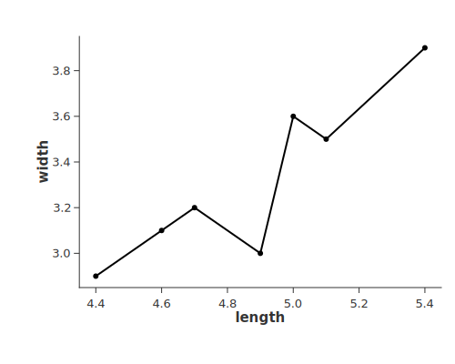

## Quick Start (External Backends)
Charton is primarily a Rust-native plotting library, and native rendering is recommended whenever possible. When certain features are not yet available, Charton can also delegate rendering to external visualization libraries.

Here, we use the Python Altair library to demonstrate how Charton works with external visualization tools. For other libraries (e.g., Matplotlib), see the [tutorial](docs/tutorial.md).

For the Python backend, make sure the required packages are available in your Python environment:

```bash
pip install polars
pip install pyarrow
```

Charton runs external plotting code in a separate process. Rust data is passed to Python via standard input, and the rendered output is returned via standard output. No temporary files are created.

```rust
use charton::prelude::*;
use polars::prelude::*;
use std::error::Error;

fn main() -> Result<(), Box<dyn Error>> {
    // Set the path to your Python executable on windows/linux/macOS
    let exe_path = r"where-is-my/python";
    let df1 = df![
        "Model" => ["S1", "M1", "R2", "P8", "M4", "T5", "V1"],
        "Price" => [2430, 3550, 5700, 8750, 2315, 3560, 980],
        "Discount" => [Some(0.65), Some(0.73), Some(0.82), None, Some(0.51), None, Some(0.26)],
    ]?;

    // Code for plotting with Altair
    let raw_plotting_code = r#"
import altair as alt

chart = alt.Chart(df1).mark_point().encode(
    x='Price',
    y='Discount',
    color='Model',
).properties(width=200, height=200)
"#;
    Plot::<Altair>::build(data!(&df1)?)?
        .with_exe_path(exe_path)?
        .with_plotting_code(raw_plotting_code)
        .save("scatter.svg")?;

    Ok(())
}
```
> ℹ️ **Note:** The Altair chart object must be assigned to a variable named `chart`, because `chart.to_json()` is used implicitly to convert the chart to JSON format. Besides, the dataframe name must be the same as the dataframe passed to `Plot::build()`.

## Interactive Plots in Jupyter
Charton integrates with evcxr, allowing you to display plots interactively in a Jupyter Notebook. To use this feature, evcxr must be installed beforehand. See the [Jupyter/evcxr article](https://depth-first.com/articles/2020/09/21/interactive-rust-in-a-repl-and-jupyter-notebook-with-evcxr/) for detailed setup instructions.

The following code shows a minimal example of this.
```rust
:dep charton = { version="0.2.0" }
:dep polars = { version="0.49.1" }

use charton::prelude::*;
use polars::prelude::*;

// Create a polars dataframe
let df = df![
    "length" => [5.1, 4.9, 4.7, 4.6, 5.0, 5.4, 4.6, 5.0, 4.4, 4.9],
    "width" => [3.5, 3.0, 3.2, 3.1, 3.6, 3.9, 3.4, 3.4, 2.9, 3.1]
]?;

// Create a layer
Chart::build(&df)?
    .mark_point()
    .encode((
        x("length"),
        y("width"),
    ))?
    // Convert the layer to a layered chart
    .into_layered()
    .show()?;
```
Run it in a Jupyter Notebook cell, and the chart will be displayed inline.

The same workflow applies when using external visualization libraries: place the corresponding Rust code snippet into a Jupyter cell, and Charton will render the visualization interactively.
```rust
:dep charton = { version="0.2.0" }
:dep polars = { version="0.49.1" }

use charton::prelude::*;
use polars::prelude::df;

// Set the path to your Python executable on windows/linux/macOS
let exe_path = r"where-is-my/python";
let df1 = df![
    "Model" => ["S1", "M1", "R2", "P8", "M4", "T5", "V1"],
    "Price" => [2430, 3550, 5700, 8750, 2315, 3560, 980],
    "Discount" => [Some(0.65), Some(0.73), Some(0.82), None, Some(0.51), None, Some(0.26)],
].unwrap();

let raw_plotting_code = r#"
import altair as alt

chart = alt.Chart(df1).mark_point().encode(
    x='Price',
    y='Discount',
    color='Model',
).properties(width=200, height=200)
"#;

Plot::<Altair>::build(data!(&df1)?)?
    .with_exe_path(exe_path)?
    .with_plotting_code(raw_plotting_code)
    .show()?;
```


## 🌐 Front-end Integration
Charton excels at decoupling the **data processing** (in Rust) from the **visualization rendering** (in the browser). By leveraging the **Vega-Lite specification** as an intermediary format, Charton ensures seamless integration with modern web applications.

The core of Charton's frontend support is its ability to generate a complete Vega-Lite JSON object. Currently, Charton achieves this by bridging the functionality of the **Altair library** (which is built upon Vega-Lite). The `to_json()` method generates the final Vega-Lite JSON object that can be consumed by any compatible JavaScript library. 

This allows you to utilize powerful frontend visualization tools like:

* **Vega-Embed:** The standard library for embedding Vega and Vega-Lite charts.
* **React-Vega:** For easy integration within React applications.
* Any library supporting the Vega-Lite or Vega standard.

The example below shows how Charton generates the specification from your Rust data and Altair code, ready for web consumption:
```rust
let chart_json = Plot::<Altair>::build(data!(&df1)?)?
    .with_exe_path(exe_path)?
    .with_plotting_code(raw_plotting_code)
    .to_json()?;

// The chart_json string can now be sent via an API endpoint
// or embedded directly in an HTML file for client-side rendering.
println!("{}", chart_json);
```
This is the output (excerpt):
```json
{
  "$schema": "https://vega.github.io/schema/vega-lite/v5.20.1.json",
  "data": {
    "name": "data-8572dbb2f2fe2e54e92fc99f68a5f076"
  },
  "datasets": {
    "data-8572dbb2f2fe2e54e92fc99f68a5f076": [
      {
        "Discount": 0.65,
        "Model": "S1",
        "Price": 2430
      },
      // ... more data rows ...
    ]
  },
  "encoding": {
    "color": {
      "field": "Model",
      "type": "nominal"
    },
    "x": {
      "field": "Price",
      "type": "quantitative"
    },
    // ... other encoding and properties ...
  },
  "mark": {
    "type": "point"
  }
}
```
## ⚡ High-Performance WebAssembly
Charton is engineered for the modern web. By stripping away unnecessary bloat, it delivers heavy-duty data power in a lightweight package:
- **Compact Footprint**: Optimized to **~4MB raw binary (~900KB after Gzip)**, making it one of the lightest Polars-integrated Wasm modules available.
- **Zero-Lag Rendering:** Designed to process and visualize data-intensive sets directly in the browser (optimized for real-time responsiveness).
- **Modern Toolchain Support:** Optimized for `wasm-pack`; compatible with modern bundlers like Vite and Webpack.
> 📖 **Wasm Getting Started:** Check out **Chapter 9** of our [Tutorial](docs/tutorial.md) for a step-by-step example of rendering a scatter plot in the browser using Wasm.

## Examples
This gallery contains a selection of examples of the plots charton can create. Go to the `examples` folder to view the source code.
<table>
    <tr>
        <td><p align="center">Altair</p></td>
        <td>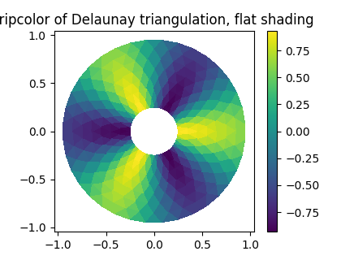<p align="center">Matplotlib</p></td>
        <td>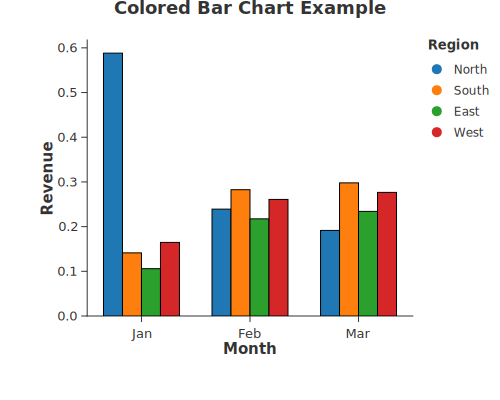<p align="center">Grouped Bar Chart</p></td>
        <td>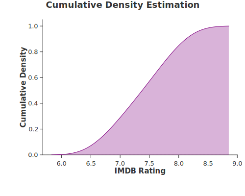<p align="center">Distribution</p></td>
    </tr>
    <tr>
        <td>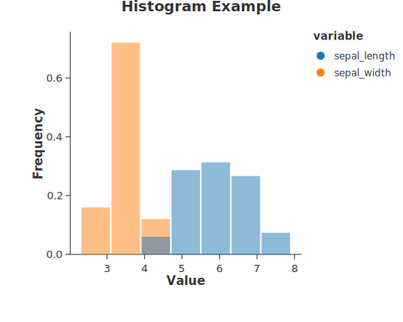<p align="center">Histogram</p></td>
        <td>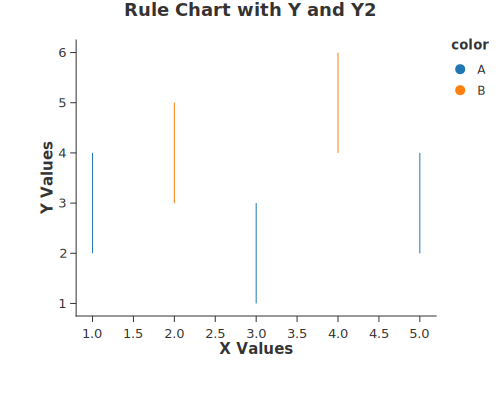<p align="center">Rule</p></td>
        <td><p align="center">Stacked Bar Chart</p></td>
        <td>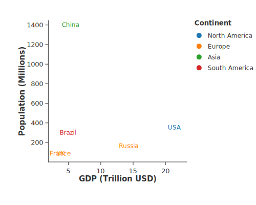<p align="center">Text</p></td>
    </tr>
    <tr>
        <td>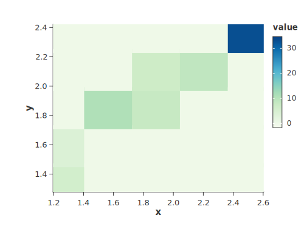<p align="center">2d Density Chart</p></td>
        <td>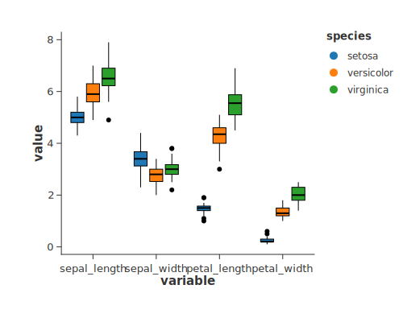<p align="center">Grouped Boxplot</p></td>
        <td>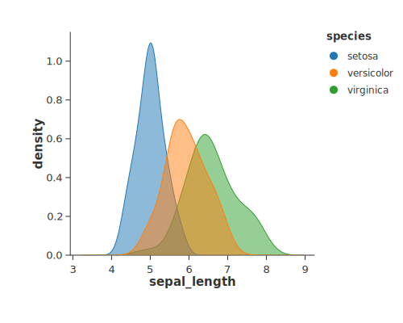<p align="center">Density Chart</p></td>
        <td>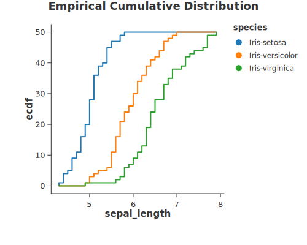<p align="center">Cumulative Frequency</p></td>
    </tr>
    <tr>
        <td>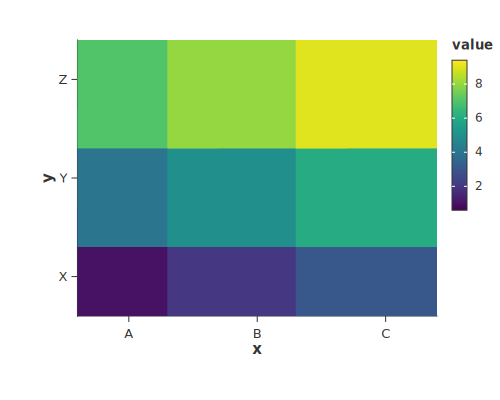<p align="center">Heatmap</p></td>
        <td>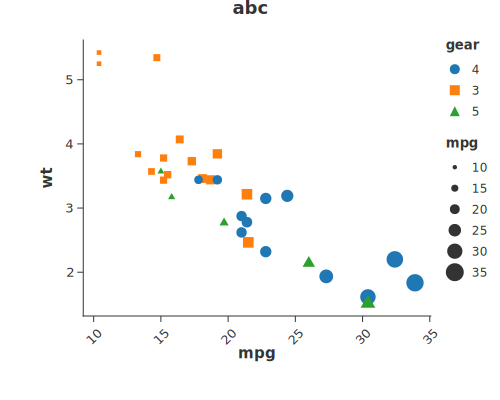<p align="center">Scatter Chart</p></td>
        <td>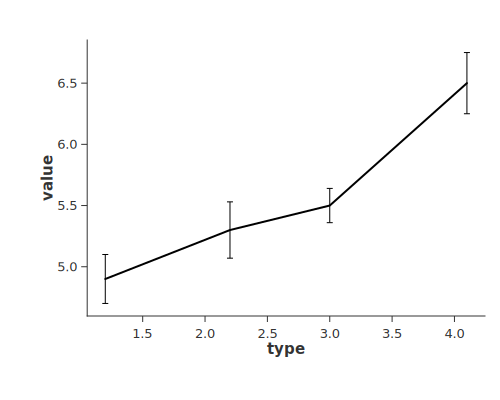<p align="center">Line Errorbar</p></td>
        <td>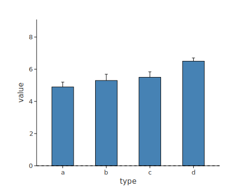<p align="center">Bar Errorbar</p></td>
    </tr>
    <tr>
        <td>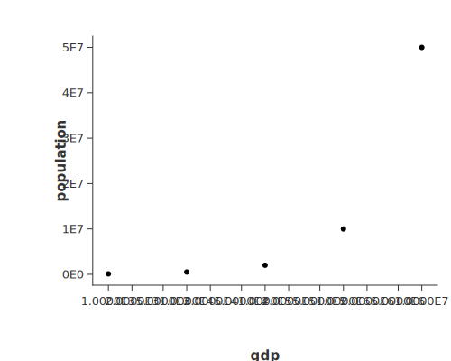<p align="center">Log Scale</p></td>
        <td><p align="center">Swapped Axes</p></td>
        <td>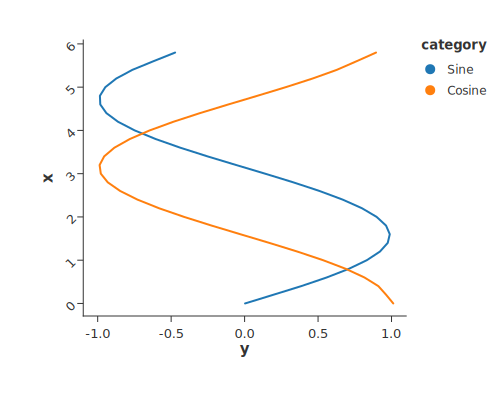<p align="center">Line</p></td>
        <td>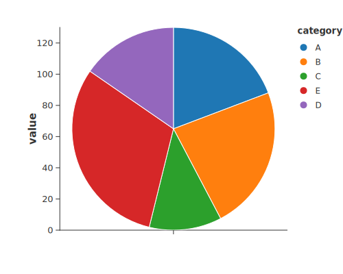<p align="center">Donut</p></td>
    </tr>
</table>

## Features
While the Rust ecosystem has seen efforts in native visualization and integration with external tools (like `PyO3`), existing solutions often suffer from poor maintenance, inefficient temporary file usage, or complex notebook environment limitations (e.g., restricted Conda support in `evcxr`).

Charton is engineered to solve these challenges, providing a modern, efficient, and user-friendly alternative with several key advantages:

| **Key Feature** | **Charton** | 💡 **Advantage / Description** |
| :--- | :--- | :--- |
| **🦀 Pure Rust Execution** | ✅ | Fully native rendering without reliance on external runtimes. |
| **📊 Polars Support** | ✅ | Seamless integration with **Polars**, allowing direct plotting from Rust DataFrames. |
| **📓 Jupyter/evcxr** | ✅ | Native support for **evcxr Jupyter notebooks** enables interactive visualization. |
| **⚡ IPC (Inter-Process Communication)** | ✅ | Enables efficient use of visualization systems **without writing temporary files**. |
| **🧩 API Friendliness** | ✅ | **Altair-like API** ensures a minimal learning curve for users familiar with Python tools. |
| **🌐 Frontend JSON Output** | ✅ | Generates **Vega-Lite JSON** for easy integration and dynamic client-side web rendering. |
| **💻 Wasm (WebAssembly)** | ✅ | Aims to bring high-performance visualization to the web.|

## 🤝 Contributions Welcome
Contributions are welcome! Whether it's improving documentation, adding new chart types, or optimizing performance, your help is appreciated.

## ⚖️ Our Commitment to Open Source
**Charton is and will always be "Open Core" under the Apache 2.0 license.**

We believe that high-performance visualization infrastructure should be a public good:
- **The Core:** The engine, statistical transforms, and standard emitters are, and will remain, licensed under **Apache 2.0**. This is a permanent commitment to the Rust community.
- **Sustainability:** Inspired by the **Polars** model, we aim to build a sustainable ecosystem. While the core remains free and open, we may explore enterprise-grade services (such as **Charton Cloud** or specialized high-performance plugins) in the future to ensure long-term maintenance and innovation.

## 📄 License
Charton is licensed under the **Apache License 2.0**.

By contributing to Charton, you agree that your contributions will be licensed under the Apache License 2.0. This ensures the project remains open and accessible while allowing for long-term sustainability.

## 🙏 Acknowledgements
- **AI Collaboration:** The development of this project has been greatly aided by AI, particularly **Qwen3-Coder** and **Kimi**, which significantly accelerated the development process.
- **Personal Support:** I would like to thank my family for taking care of our home, which gave me the time and focus to work on this project.

---

*Note: This project is developed independently and is not affiliated with or endorsed by any organization.*