[English](./README.md) | [简体中文](./README_zh.md)

# Charton - 一个多功能的 Rust 绘图库
**Rust 版 Altair 风格声明式绘图。高性能、Polars 原生支持、且兼容 Wasm。**
> *“非常棒的项目。... 作为一个生态系统运行得非常完美。”*
> — [**Ritchie Vink**](https://github.com/pola-rs/polars/issues/25941), Polars 创始人

[](https://crates.io/crates/charton)
[](https://docs.rs/charton)
[](https://github.com/wangjiawen2013/charton/actions)
[](LICENSE)

**Charton** 是一款高性能 Rust 绘图库，其声明式 API 灵感源自 [Altair](https://altair-viz.github.io/)。它提供原生 [Polars](https://github.com/pola-rs/polars) 支持，并填补了 Rust 与 Python 可视化生态系统（Altair/Matplotlib）之间的空白。通过与 evcxr_jupyter 集成，还可以在 Notebook 中实现交互式数据探索。

<table>
    <tr>
        <td>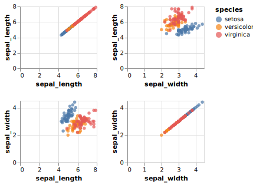<p align="center">Altair</p></td>
        <td>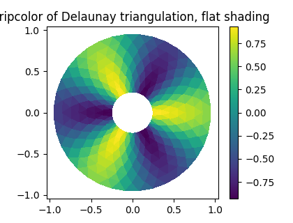<p align="center">Matplotlib</p></td>
        <td>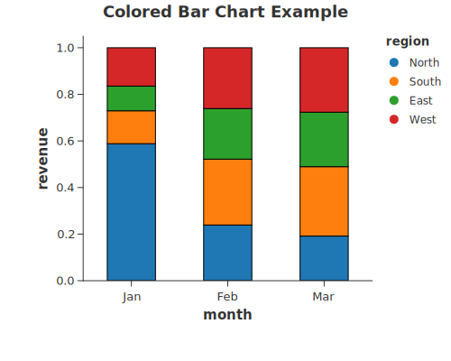<p align="center">Stacked Bar Chart</p></td>
        <td>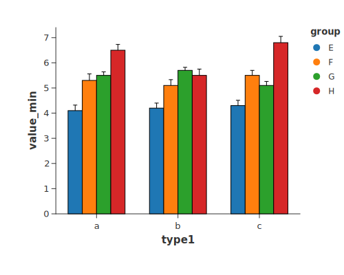<p align="center">Grouped Bar With Errorbar</p></td>
        <td>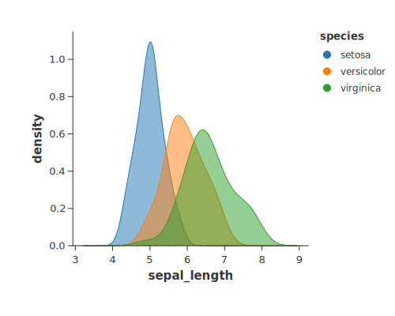<p align="center">Density</p></td>
    </tr>
    <tr>
        <td>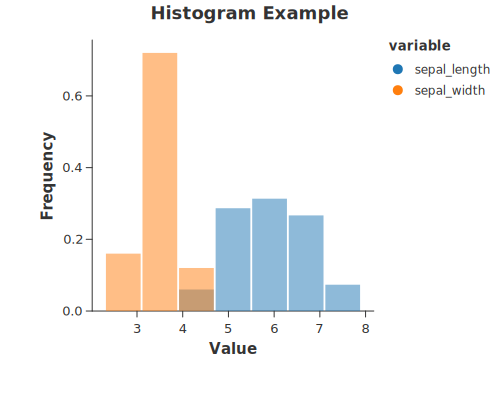<p align="center">Histogram</p></td>
        <td>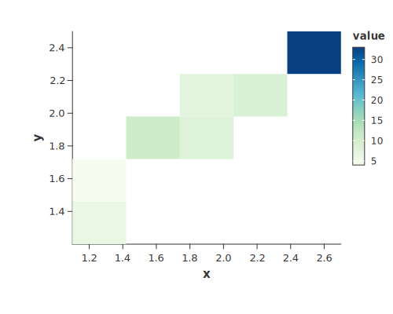<p align="center">2d Density Chart</p></td>
        <td>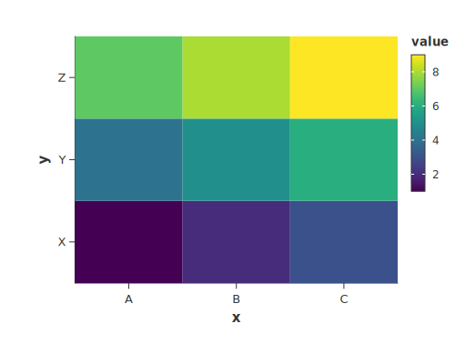<p align="center">Heatmap</p></td>
        <td>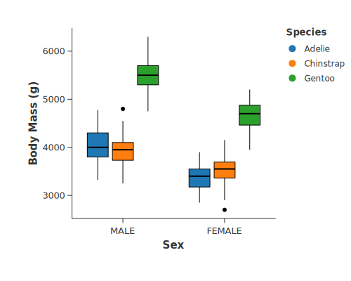<p align="center">Grouped Boxplot</p></td>
        <td>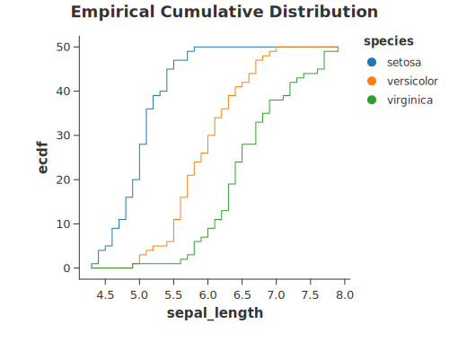<p align="center">Cumulative Frequency</p></td>
    </tr>
    <tr>
        <td>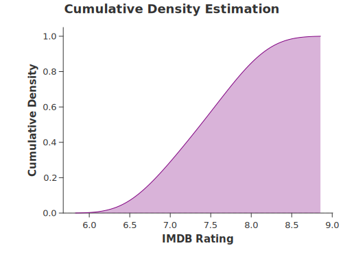<p align="center">Distribution</p></td>
        <td>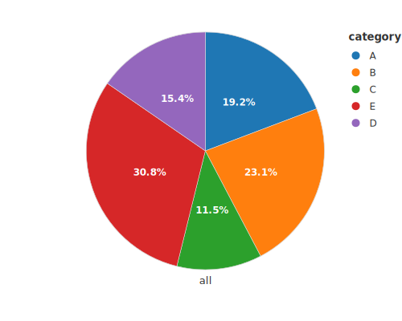<p align="center">Pie</p></td>
        <td>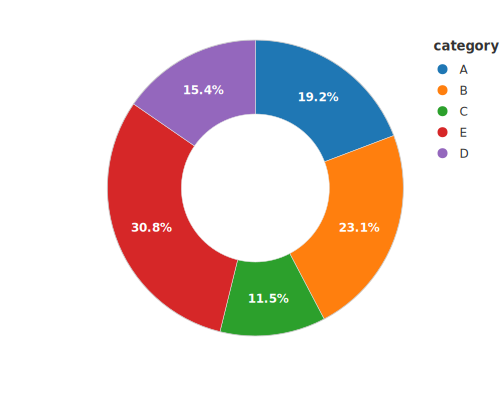<p align="center">Donut</p></td>
        <td>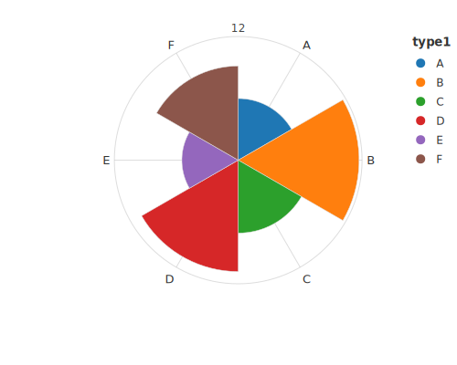<p align="center">Rose</p></td>
        <td>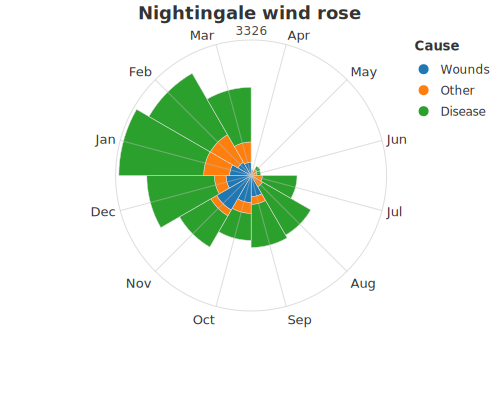<p align="center">Nightingale</p></td>
    </tr>
    <tr>
        <td>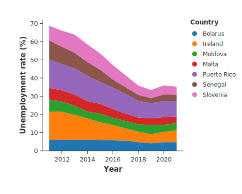<p align="center">Simple Stack Area</p></td>
        <td>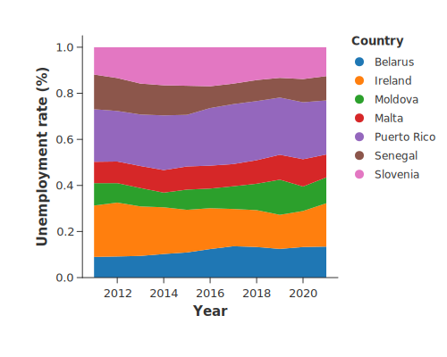<p align="center">Normalized Stacked Area</p></td>
        <td>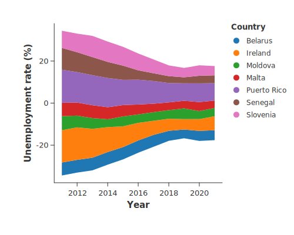<p align="center">Steamgraph</p></td>
        <td>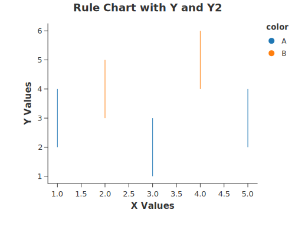<p align="center">Rule</p></td>
        <td>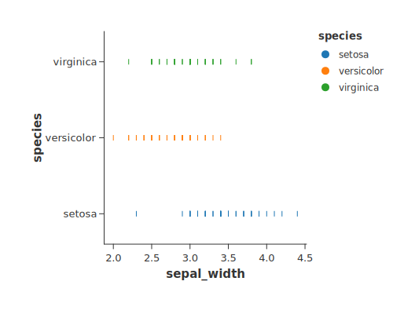<p align="center">Strip</p></td>
    </tr>
</table>

## 安装
在 `Cargo.toml` 中添加：

```toml
[dependencies]
charton = "0.5"                                         # 标准版 (默认开启并行计算)
charton = { version = "0.5", default-features = false } # 用于 WASM / 单线程环境
charton = { version = "0.5", features = ["resvg"] }     # 支持导出 PNG
charton = { version = "0.5", features = ["bridge"] }    # 支持 Altair/Matplotlib 互操作
```

## 快速上手
Charton 提供了高级声明式 API。通过一行代码就可以实现可视化：

```rust
use charton::prelude::*;

// 数据：身体指标（身高 vs. 体重）
let height = vec![160.0, 165.0, 170.0, 175.0, 180.0];
let weight = vec![55.0, 62.0, 68.0, 75.0, 82.0];

// 一行代码绘图
chart!(height, weight)?.mark_point()?.encode((alt::x("height"), alt::y("weight")))?.save("out.svg")?;
```

## 从宏到生产级 API
虽然 `chart!` 宏在快速原型设计和书写简单脚本时非常方便，但在需要显式处理数据的生产环境中，建议使用底层的 `Chart::build` API。

### 1. 专业构建 API
对于复杂的应用程序，使用 `Chart::build` 可以完全控制 `Dataset` 的生命周期。

```rust
let ds = Dataset::new()
    .with_column("height", height)?
    .with_column("weight", weight)?;

Chart::build(ds)? // 等价于 chart!(ds)?
    .mark_point()?
    .encode((alt::x("height"), alt::y("weight")))?
    .save("out.svg")?;
```

> **提示**：如果需要在循环或条件逻辑中动态添加列，请使用 `add_column`。

### 2. Polars 集成
针对 Polars 用户，Charton 提供了 `load_polars_df!` 宏，可将 `DataFrame` 转换为 Charton 内部专用的 `Dataset`。

```rust
use polars::prelude::*;

let df = df![
    "height" => vec![160.0, 165.0, 170.0, 175.0, 180.0],
    "weight" => vec![55.0, 62.0, 68.0, 75.0, 82.0]
]?;

// 将 Polars DataFrame 转换为 Charton Dataset
let ds = load_polars_df!(df)?;

Chart::build(ds)? // 等价于 chart!(ds)?
    .mark_point()?
    .encode((alt::x("height"), alt::y("weight")))?
    .save("out.svg")?;
```

**兼容性说明**: 由于 Polars API 变化频繁，Charton 使用带版本标记的宏来处理兼容性。不再支持 0.42 以下的版本。

|Polars 版本          |使用的宏                   |状态          |
|:--------------------|:-------------------------|:-------------|
|0.53+                |`load_polars_df!(df)?`    |最新（标准）   |
|0.42 - 0.52          |`load_polars_v42_52!(df)?`|旧版支持       |
|< 0.42               |N/A                       |不支持        |

## 分层语法
受图形语法（如 `ggplot2` 和 `Altair`）影响，Charton 用模块化的图层系统取代了固定模板。通过组合原子标记（Marks）能构建出丰富的图表类型，极大的提高了作图灵活性。

```rust
// 创建独立图层
let line = chart!(height, weight)?
    .mark_line()?
    .encode((alt::x("height"), alt::y("weight")))?;

let point = chart!(height, weight)?
    .mark_point()?
    .encode((alt::x("height"), alt::y("weight")))?;

// 组合成复合图表
line.and(point).save("layered.svg")?;
```

## 交互式作图 (Jupyter)
Charton 与 evcxr_jupyter 集成，支持交互式数据探索。将 `.save()` 替换为 `.show()` 即可直接在 jupyter notebook 单元格中显示 SVG：

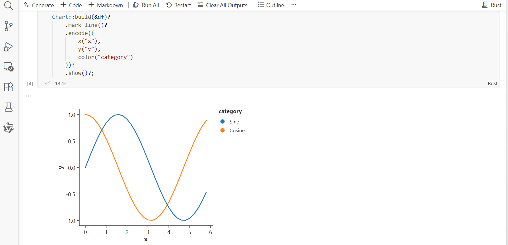

## WebAssembly 与前端
Charton 支持 WebAssembly 和现代 Web 前端；详情请参考 [Charton Docs](https://wangjiawen2013.github.io/charton)。

## 利用第三方可视化生态
Charton 通过高速 IPC 将 Rust 与成熟的可视化生态（如 **Altair** 和 **Matplotlib**）连接起来，使用户能够在统一的工作流中利用多样化、专业级的绘图工具。详情请参考 [Charton Docs](https://wangjiawen2013.github.io/charton)。

## 工业级可视化 
相比于一些图表工具中随处可见的硬编码和隐式配置覆盖，Charton 坚持“图形语法”的底层逻辑，为极端负载下的数据处理提供了稳健、安全的类型保障。最核心的 Scale Arbitration（比例仲裁）机制将复杂的业务数据统一抽象为了单一的事实来源。这意味着不再需要处理破碎的绘图补丁，就能在不同图层间获得完全一致的数学表现和色彩映射。

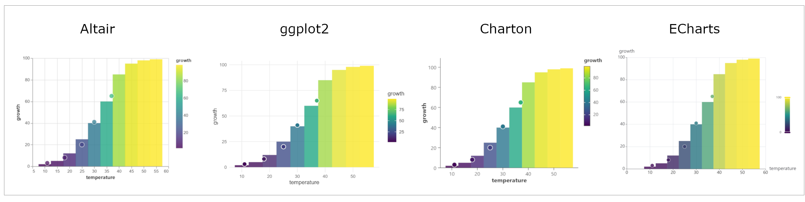
*该图展示了 Charton 中的语义同步。异源数据（散点）被锚定在全局背景（柱状图）上。通过在所有图层中强制执行单一事实来源，Charton 保持了绝对的颜色一致性，确保样本在全局背景中得到准确的语境化呈现。*

## 出版级质量
Charton 作图精准，提供对复杂标记的像素级控制。无论是用于生物医学研究的多层误差线（ErrorBar），还是用于金融领域的高密度散点图，Charton 都能提供顶尖期刊所需的审美严谨性。

<table>
    <tr>
        <td>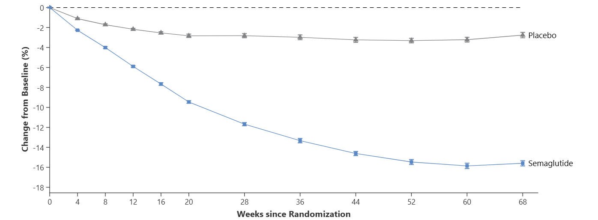<p align="center">NEJM</p></td>
        <td>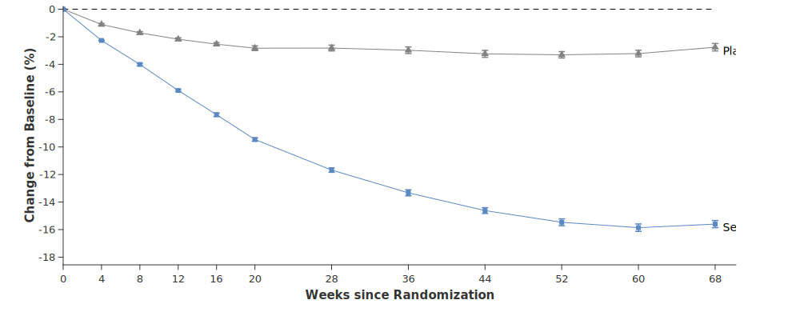<p align="center">Charton</p></td>
    </tr>
</table>

*使用 Charton 复现了 2021 年新英格兰医学杂志上发表的使用减肥药司美格鲁肽进行体重管理的研究论文中的图 1A。*

## 文档
请访问 [Charton Docs](https://wangjiawen2013.github.io/charton) 查看完整文档。

## License
Charton 基于 **Apache License 2.0** 许可证开源。
