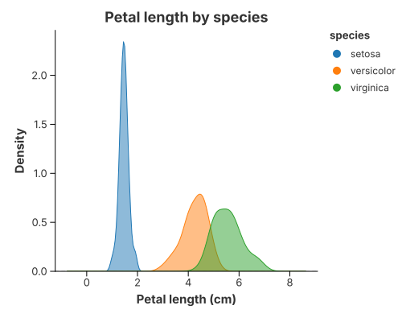
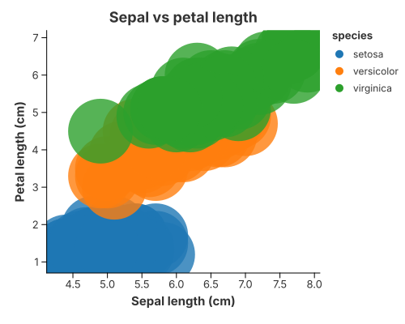

# Feature Analysis for Classification (Iris)

## Background

Before training a classifier you look at two things: how each **feature** is
distributed *within each class*, and whether the classes are **separable** in
feature space. This study uses the classic Iris dataset — three species, four
measurements — to reproduce those two views with the convenience marks.

## Class-conditional distributions



`mark_density` reads the feature from `x` and gives one curve per `color` group,
so you can see how a feature separates the classes. Petal length is clearly
**bimodal**: *setosa* sits far to the left, while *versicolor* and *virginica*
overlap in the middle. A single threshold on this feature would split setosa
perfectly but confuse the other two.

## Feature separation



A scatter of two features, coloured by class, shows the **decision boundary** a
linear model would try to find. *Setosa* is linearly separable from the other
two; *versicolor* and *virginica* share a region where any straight boundary has
to trade false positives for false negatives.

## Implementation

```rust
{{#include ../../../examples/case_data_science.rs}}
```

Both figures are a single encoding each: `y`/`x` for the values and `color` for
the class. The axis and legend titles come from the original columns
(`petal_length`, `sepal_length`, `species`) automatically.

## What it demonstrates

- **`mark_density`** for class-conditional distributions, one curve per group.
- **`mark_point` + `color`** for feature separation and decision boundaries.
- The grammar behind both: a density is `transform_density` + `mark_area`; a
  scatter is `mark_point`. See [1-D Density](../gallery/density_1d.md) and
  [Scatter](../gallery/point_charts.md).

## See also

- [Violin](../gallery/violin.md) — the same distributions as an outline with an
  inner box.
- [2-D Density](../gallery/density_2d.md) — the joint distribution of two
  features.
- [Scatter matrices](../gallery/point_charts.md) — the full pairwise view.
