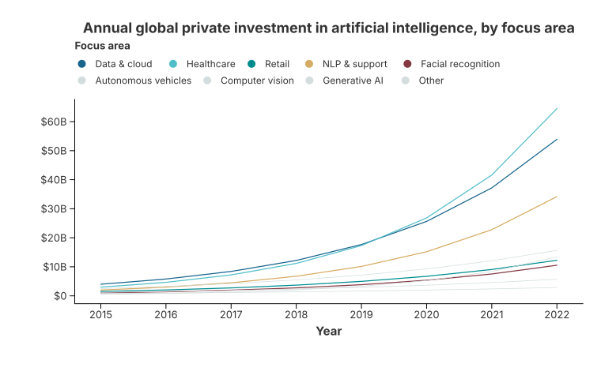

# Economist-Style Highlights: AI Investment

## Background

A recurring request is to reproduce the visual language of *The Economist*: a
small number of focus series drawn in strong colours and a heavier stroke, while
every other series recedes into thin grey context. The original report ([issue
about legend and label customisation](https://github.com/wangjiawen2013/charton))
also needed two things Charton did not offer at the time:

- the legend had to be renamed and positioned at the top;
- the y axis had to read `$20B`, not `2.0000E10` or `20000000000`.

This case study rebuilds that chart with synthetic data, so it runs without any
external file.

## Strategy

The chart is assembled in three moves:

1. **Split the data** into the areas that should stand out and the areas that
   provide context.
2. **Layer the two charts** with `.and()`. The context layer uses a thinner
   stroke, so the two layers genuinely differ.
3. **Format the labels.** `LabelFormat` handles both the axis (`$0` … `$60B`) and
   the legend entries (long data names become short, readable ones).

## Implementation

```rust
{{#include ../../../examples/economist_chart.rs}}
```



## What to notice

### Formatting is attached to the chart, not the theme

```rust
let money = LabelFormat::new()
    .with_prefix("$")
    .with_compact_notation()   // 20_000_000_000 -> 20B
    .with_precision(0);
```

`with_y_label_format` applies it to the axis, `with_legend_label_format` to the
legend entries and the colour bar. A closure can replace either one entirely:

```rust
LabelFormat::new().with_text_formatter(|label| match label {
    "Medical and healthcare" => "Healthcare",
    other => other,
})
```

The same formatter is used when the layout engine *measures* the labels, so the
axis reserves exactly the width the formatted text occupies.

### Renaming a legend is not renaming a field

`with_color_label("Focus area")` changes only the legend title. The data column
stays `Entity`, so colours and grouping are unaffected. This is why the title
lives on the aesthetic mapping separately from the field name.

### One palette for the layered chart

A layered chart keeps the theme of its first layer, and the merged colour domain
lists that layer's categories first. The palette is therefore built as *one
colour per focus area, then grey for every context area*:

```rust
let mut palette: Vec<SingleColor> = ["#17648d", "#51bec7", "#008c8f", "#d6ab63", "#843844"]
    .iter()
    .map(|hex| (*hex).into())
    .collect();
palette.extend(std::iter::repeat_n(SingleColor::from("#d4dddd"), CONTEXT.len()));
```

The context layer then only has to lower the stroke width; its own palette is
not needed, because the first layer's theme already covers every category.

## Using the real dataset

The synthetic series above follow the same shape as the original CSV. With
Polars, the split is a one-line mask instead of two constants:

```rust
let ds = load_polars_df!(df.filter(&mask)?)?;              // focus areas
let ds_context = load_polars_df!(df.filter(&!mask)?)?;     // everything else
```

Both datasets keep the same column names, so the chart code is unchanged.
