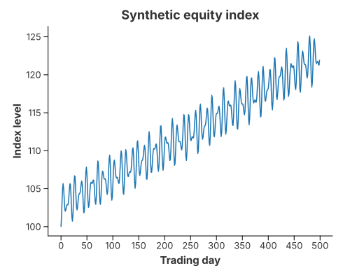
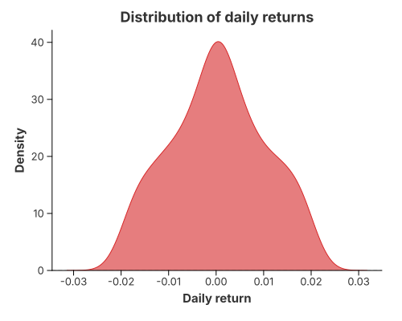

# Risk Dashboard for an Equity Index

## Background

A small risk view of a market series has two halves: the **level** over time and
the **distribution of returns**. The first shows the path; the second shows the
drift, the volatility and (if present) the tails that drive risk.

The series here is **synthetic and deterministic** — a small positive drift plus
a periodic volatility component, generated without any random number generator —
so the example is fully reproducible.

## Index level over time



`mark_line` draws the index against the trading day. The up-drift is visible, but
so are the drawdowns and the changing volatility (the calm and turbulent
stretches come from the periodic term).

## Distribution of daily returns



`mark_density` of the daily returns gives the risk picture: the curve is
**off-centre** (positive drift) and its **width** is the volatility. A real
return series would also show **fat tails** — more mass far from the centre than a
normal distribution predicts — which is what a risk model has to capture.

## Implementation

```rust
{{#include ../../../examples/case_finance.rs}}
```

The data is built in plain Rust vectors and handed to `chart!`; the two figures
are then a `mark_line` and a `mark_density`, each with an explicit visual style
via `configure_line` / `configure_density`.

## What it demonstrates

- **`mark_line`** for a time series, with the colour set explicitly.
- **`mark_density`** for a return distribution, one line to draw.
- The grammar underneath: the density is `transform_density` + `mark_area`
  (`mark_density`); the line is a single `mark_line`.

## See also

- [1-D Density](../gallery/density_1d.md) — tuning the smoothing (bandwidth,
  kernel).
- [Cumulative Density](../gallery/cumulative_density.md) — the distribution as a
  CDF, useful for value-at-risk style questions.
- [Line Charts](../gallery/line_charts.md) — trends and multiple series.
