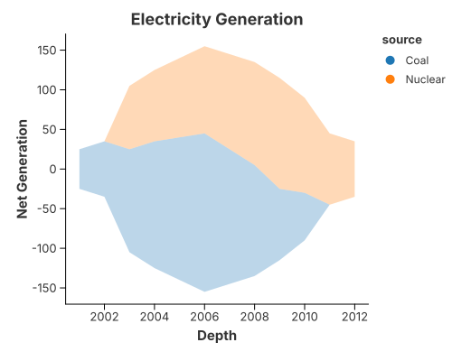
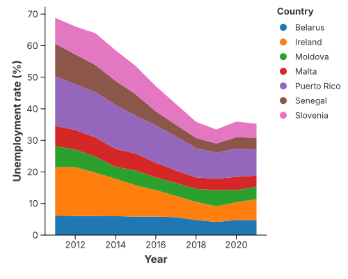
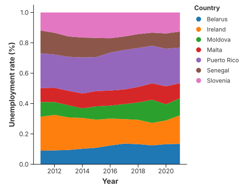
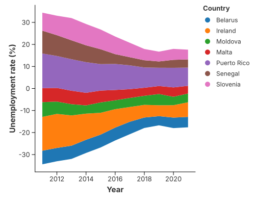

# Area Charts

An area fills the region between a line and its baseline. Adding a colour field
stacks the series; changing the stack baseline yields the streamgraph.

## Area chart



```rust
{{#include ../../../examples/area.rs}}
```

## Gaps

A missing `x` or `y` opens the area at that point instead of bridging it. See
[Missing Values & Gaps](../concepts/missing_values.md).

## Simple Stacked Area Chart
Adding a color field to area chart creates stacked area chart by default. For example, here we split the area chart by country by setting `stack` to `"stacked"`.

```rust
{{#include ../../../examples/simple_stacked_area_chart.rs}}
```



## Normalized Stacked Area Chart
You can also create a normalized stacked area chart by setting `stack` to `"normalize"` in the encoding channel. Here we can easily see the percentage of unemployment across countries.

```rust
{{#include ../../../examples/normalized_stacked_area_chart.rs}}
```



## Steamgraph
We can also shift the stacked area chart’s baseline to center and produces a streamgraph by setting `stack` to `"center"` in the encoding channel.

```rust
{{#include ../../../examples/steamgraph.rs}}
```

