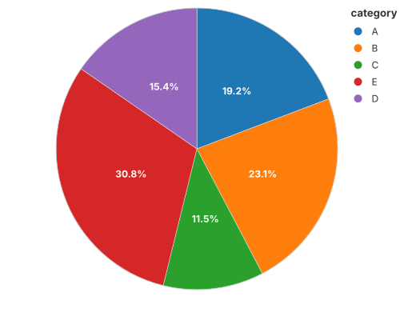
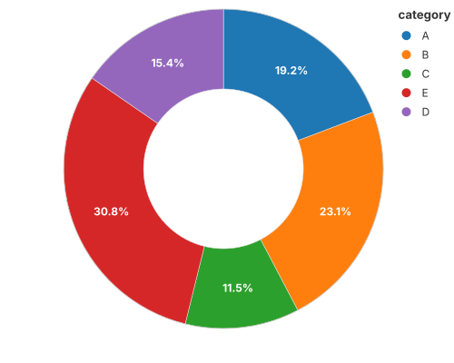
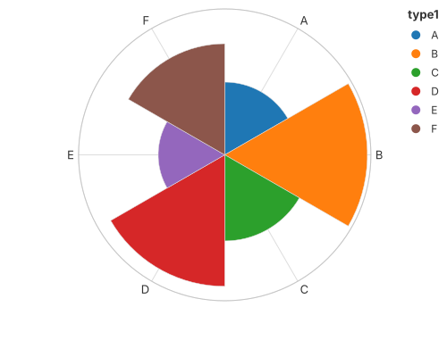
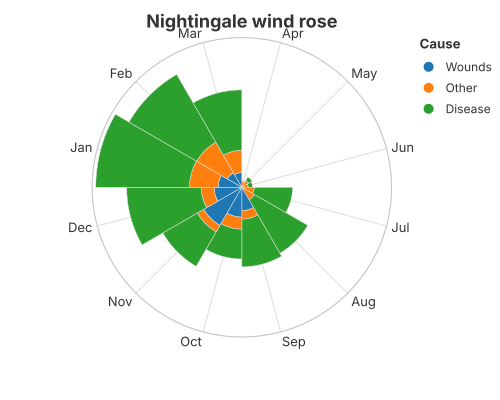

# Pie, Donut, Rose & Nightingale

All four are the same primitive: a **bar on a polar coordinate system**. Change
the coordinate, the stacking and the angle, and the bar becomes a wedge, a ring,
a petal or a polar-area chart. No pie-specific mark exists or is needed.

## Pie



```rust
{{#include ../../../examples/pie.rs}}
```

## Donut



The same wedges with a hole: an inner radius on the polar coordinate.

```rust
{{#include ../../../examples/donut.rs}}
```

## Rose (polar bar)



Bars whose height is a radius, arranged by angle.

```rust
{{#include ../../../examples/rose.rs}}
```

## Nightingale (polar area)



Equal angles, radius proportional to the value — Florence Nightingale's
coxcomb.

```rust
{{#include ../../../examples/nightingale.rs}}
```

## See also

- [Coordinate Systems](../grammar/coordinates.md) — how `CoordSystem::Polar`
  turns Cartesian positions into angles and radii.
