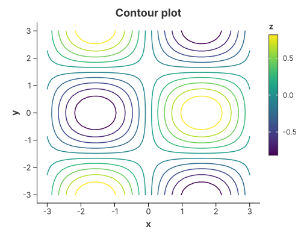
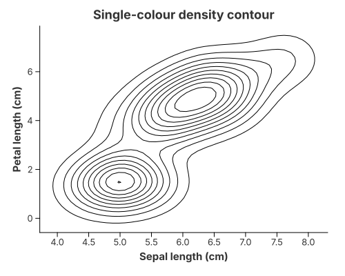

# Contour Plots

A contour plot draws the lines (or bands) where a scalar field equals a set of
levels.

`mark_contour` is the convenient way to draw one. It is a **composite** mark:
behind the scenes it expands into the ordinary recipe

```text
contour = iso-line stat (marching squares)  +  open-path geometry
```

so the general pieces stay available. `transform_contour` works on any regular
grid of `x`, `y` and `z` — an elevation map, a pressure field, a bivariate
density — and `mark_path` draws any ordered polyline.

## Iso-lines of a grid



Name the scalar field explicitly (the crate has no `z` channel) and read `x`/`y`
from the encodings. The lines are coloured by their level by default.

```rust
{{#include ../../../examples/contour.rs}}
```

### Built from the primitives

The same picture without `mark_contour`:

```rust
{{#include ../../../examples/contour_manual.rs}}
```

## What the transforms produce

Both steps **replace the table**, so to wire them together by hand you need to
know the columns each one emits. A transform is just a function that reads some
columns and writes others:

| Call | Reads | Emits |
|---|---|---|
| `transform_contour(x, y, z)` | the grid (`x`, `y`, `z`) | `x`, `y`, `path_group`, `level` |
| `transform_density_2d(x, y)` | two numeric columns | `x`, `y`, `density` |

- **`path_group`** is not built in: it is an ordinary data column, and
  `mark_path` connects the rows that share it, in row order. You wire it to the
  `path_group` channel with `alt::path_group("path_group")`.
- **`level`** is each line's value. Map it to `color` to colour the lines, or
  drop the colour encoding for a single-colour contour. `mark_contour` does this
  colour mapping for you by default.

Every name above is only a **default output name**. Rename them with
`ContourTransform::with_as` and `ContourTransform::with_level_as`, then use the
new names downstream — see the
[transforms reference](../grammar/transforms.md).

## How the pieces fit

| Piece | What it does | Reused by |
|---|---|---|
| `transform_contour` | marching squares over a regular grid → iso-lines | contours of any scalar field, density contours |
| `transform_density_2d` | bivariate kernel density over a grid | density contours, density heatmaps |
| `mark_contour` | the `transform_contour` + open-path composite | ready-made contour plots |
| `mark_path` | connects a `path_group` in row order, open, stroked | contour lines, custom curves, parallel coordinates |
| `mark_polygon` | the closed, filled form of the same geometry | violin outlines, maps, filled ribbons |

Why `mark_path` and not `mark_polygon`? A contour is a **line**: some contours
are open (they end on the plot edge), others are loops, but in both cases we
want the stroke, not a filled disc. `mark_polygon` would close every open
contour with a spurious edge and fill every loop. See [Connecting the
dots](../grammar/marks.md#connecting-the-dots-line-path-and-polygon).

`ContourTransform` accepts either a number of evenly spaced levels
(`with_levels(n)`) or explicit ones (`with_levels_values(vec![...])`);
`configure_contour` exposes those as `with_levels(n)` / `with_levels_values(...)`.

Colouring the lines by `level` is optional. Turn it off with
`configure_contour(…).with_color_by_level(false)` and the path is drawn with the
mark's own stroke instead — a single-colour contour:



```rust
{{#include ../../../examples/contour_single.rs}}
```

## From scattered points

A bivariate density is just another scalar grid, so `transform_density_2d` feeds
`mark_contour("density")` — the familiar `kdeplot` / `geom_density_2d` picture.
The grid can also be drawn filled instead of as lines. Both are on the
[2-D Density](density_2d.md) page:

```text
scatter  →  transform_density_2d  →  mark_contour
```

## See also

- [2-D Density](density_2d.md) — density contours and density heatmaps.
- [Heatmaps](heatmaps.md) — `mark_rect` over binned data.
- [The Layer Pipeline](../concepts/grammar_pipeline.md) — the stat/position/geom
  model behind all of this.
- `examples/contour.rs`, `examples/contour_manual.rs`, `examples/contour_single.rs`,
  `examples/density_contour.rs`.
