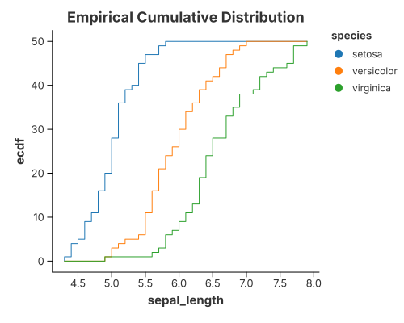

# Cumulative Density

A cumulative density is the integral of a density curve: the share of the data
at or below each value. It rises from 0 to 1 and reads the same as an empirical
CDF, but is smoothed by the same kernel used for the [1-D density](density_1d.md).

`mark_density` draws it with `configure_density(…).with_cumulative(true)`; behind
the scenes that is still the ordinary recipe

```text
transform_density(cumulative = true)   //  →  (value, cumulative density)
  → mark_area
```

## Cumulative density curve


```rust
{{#include ../../../examples/distribution.rs}}
```

### Built from the primitives

The same picture without `mark_density`: set `.with_cumulative(true)` on
`DensityTransform` and draw the curve with `mark_area`.

```rust
{{#include ../../../examples/distribution_manual.rs}}
```

## Empirical CDF (cumulative frequency)

When you want the exact, unsmoothed version, use a window `CumeDist` and draw it
as a step line. No binning or smoothing is involved — every observation is a
step.



```rust
{{#include ../../../examples/cumulative_frequency.rs}}
```

Both pictures answer "what fraction is below x?", one smooth and one as a step
function. Use `transform_window(WindowOnlyOp::CumeDist)` for the exact ECDF,
`mark_density` with `with_cumulative(true)` for the kernel-smoothed curve.

## See also

- [1-D Density](density_1d.md)
- [Line Charts](line_charts.md)
- [Transforms & Columns](../grammar/transforms.md)
