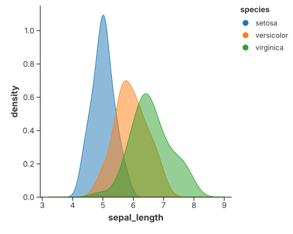

# 1-D Density

A one-dimensional density estimate (a KDE) draws the shape of a numeric column
as a smooth curve — the smooth counterpart of a histogram.

`mark_density` is the convenient way to draw one. It is a **composite** mark:
behind the scenes it expands into the ordinary recipe

```text
transform_density   // numeric column  →  (value, density)
  → mark_area       // draw the curve
```

so you can always drop to the pieces. The last section writes the same picture
out by hand.

## Density plot



Read the value from `x`; each `color` group gets its own curve.

```rust
{{#include ../../../examples/density.rs}}
```

By default the estimator keeps the tails (`trim = false`), so the curve fades out
past the last observation — the `geom_density` look. A violin is the very same
curve stood upright and mirrored; see [Violin](violin.md).

## Tuning the curve

Estimating the curve (statistics) and drawing it (geometry) are configured
separately. `configure_density` forwards the estimator options:

| Method | Meaning |
|---|---|
| `configure_density(…).with_bandwidth(BandwidthType::Silverman)` | smoothing rule (Scott by default) |
| `.with_kernel(KernelType::Epanechnikov)` | smoothing kernel |
| `.with_trim(true)` | stop each curve at its own data range instead of the shared grid |
| `.with_counts(true)` | scale each curve by its group size (counts, not density) |
| `.with_cumulative(true)` | draw the cumulative distribution instead |
| `.with_color(…)`, `.with_opacity(…)`, `.with_stroke(…)` | the area's visual style |

The underlying `transform_density` **replaces the table**: it reads the numeric
column and emits `(value, density)` plus one column per `groupby` field. See
[Transforms & Columns](../grammar/transforms.md) for the full column contract.

## Built from the primitives

The same picture without `mark_density`: `transform_density` estimates the curve
and `mark_area` draws it.

```rust
{{#include ../../../examples/density_manual.rs}}
```

## See also

- [Composing Your Own](primitives.md) — recombining the primitives into new
  pictures the marks do not cover.
- [Violin](violin.md) — the upright, mirrored form, and its grouped/split layouts.
- [2-D Density](density_2d.md) — two columns at once.
- [Cumulative Density](cumulative_density.md) — the integral of the curve.
