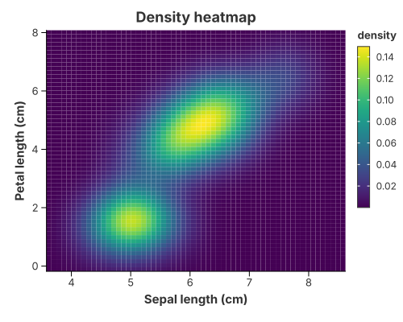
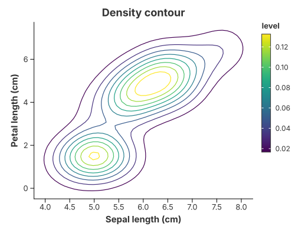

# 2-D Density

A two-dimensional density estimate describes the **joint** distribution of two
numeric columns. `transform_density_2d` estimates it on a regular grid; the same
grid can then be drawn two ways — as a filled heatmap, or as iso-density lines.

```text
transform_density_2d                 // (x, y)  →  (x, y, density) grid
  ├─ mark_rect                       // filled density heatmap
  └─ transform_contour → mark_path   // iso-density lines
```

## Density heatmap



```rust
{{#include ../../../examples/density_heatmap.rs}}
```

`mark_rect` paints one cell per grid node. Set the x and y `bins` to the grid
size so the cells are not merged back together.

## Density contours



```rust
{{#include ../../../examples/density_contour.rs}}
```

Here the grid is passed to `transform_contour`, which turns it into iso-lines
that `mark_path` draws. Colour them by `level` for the familiar
`kdeplot` / `geom_density_2d` picture, or drop the colour channel for a
single-colour contour.

## The column contract

Both steps **replace the table**, so to wire them together you need to know the
columns each one emits:

| Call | Reads | Emits |
|---|---|---|
| `transform_density_2d(x, y)` | two numeric columns | `x`, `y`, `density` |
| `transform_contour(x, y, z)` | the grid | `x`, `y`, `path_group`, `level` |

`density` is consumed by the contour step, so it never appears in `encode`.
Rename the outputs with `Density2DTransform::with_as` and
`ContourTransform::with_as` / `with_level_as`.

## Tuning the estimate

| Method | Meaning |
|---|---|
| `Density2DTransform::with_grid_size(n)` | grid nodes per axis (default 50) |
| `.with_padding(f)` | widen the grid past the data so the tails are visible |
| `.with_bandwidth(BandwidthType::Silverman)` | smoothing rule |

A dashed contour is `.configure_path(|m| m.with_dash([6.0, 4.0]))`.

## See also

- [Contour Plots](contours.md) — the general marching-squares contour, for any scalar grid.
- [Heatmaps](heatmaps.md) — `mark_rect` over binned data.
- [Transforms & Columns](../grammar/transforms.md).
