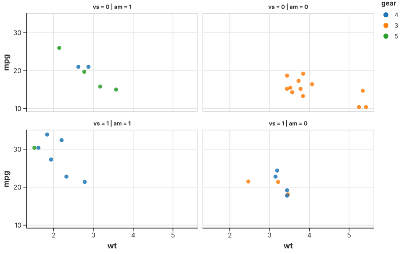

# Faceting

Faceting draws the same layers once per panel. It is a property of the chart,
not of any mark, so every recipe on this site can be faceted by adding one call.

## Grid faceting (two dimensions)



Arrange panels by two categorical columns — here `vs` across and `am` down.

```rust
{{#include ../../../examples/facet_grid.rs}}
```

## Wrap faceting (one dimension)

A single categorical column wrapped into a grid. See the
[faceted violin](violin.md#grouped-and-faceted-violins) for a complete example,
or `tests/test_facet_wrap.rs` for the unemployment-by-country recipe.

## Free scales

By default every panel shares one scale (the point of faceting: panels are
comparable). `FacetSpec::wrap(...).with_strategy("free")` (and `free_x` /
`free_y`) lets each panel train its own, for panels whose ranges differ wildly.

## See also

- [Multi-View: Faceting & Concatenation](../layout/views.md)
