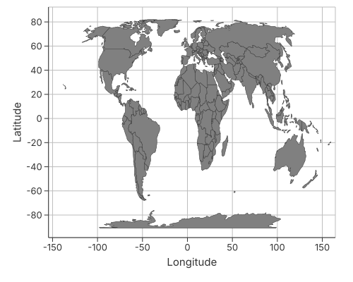

# Geospatial

Map polygons are `mark_geoshape` with a `path_group` per region; points and
labels layer on top with the ordinary marks. The projection is a property of the
coordinate system.

## World map



```rust
{{#include ../../../examples/world_map.rs}}
```

## See also

- [Coordinate Systems](../grammar/coordinates.md) — `CoordSystem::Geo` and the
  available projections.
