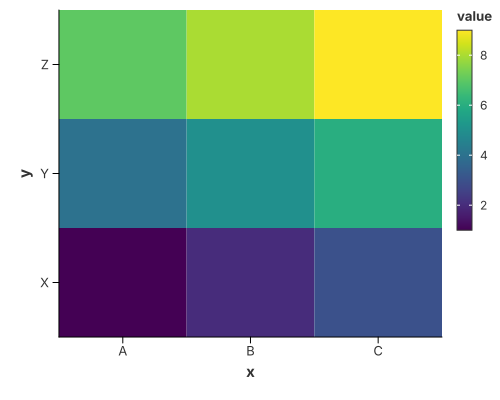
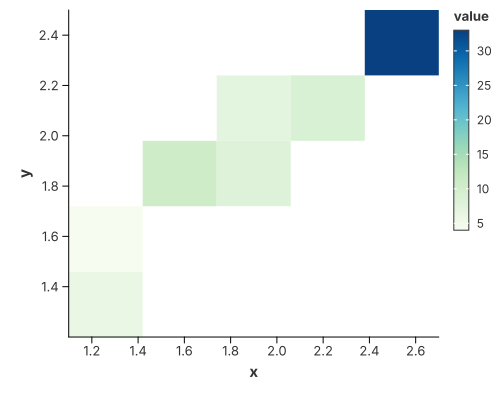

# Heatmaps

A heatmap is `mark_rect` over two position axes, coloured by a value. The only
question is whether the axes are categorical or continuous.

## Categorical heatmap



Each `(x, y)` pair is one cell, coloured by its value.

```rust
{{#include ../../../examples/heatmap.rs}}
```

## Continuous heatmap (2-D binning)



The same mark with automatic binning on both axes — a "2-D histogram" heatmap.

```rust
{{#include ../../../examples/heatmap_rect.rs}}
```

## See also

- [Contour Plots](contours.md) — the smooth, iso-line alternative to a binned
  heatmap, including [density contours](contours.md#density-contours).
