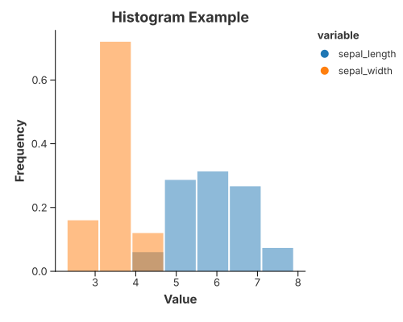

# Histogram

`mark_hist` bins a numeric column for you and draws the counts as bars — the
classic first look at a distribution. The bin count follows from the data unless
you set `alt::x(...).with_bins(n)`.



```rust
{{#include ../../../examples/histogram.rs}}
```

Add a `color` field to overlay several columns in one frame, and
`alt::y("count").with_normalize(true)` to read frequencies instead of raw counts.

## See also

- [1-D Density](density_1d.md) — the smoothed version of the same picture.
- [Bars, Ranges & Comparisons](uncertainties_and_trends.md) — `mark_bar` when you already
  have the counts.
