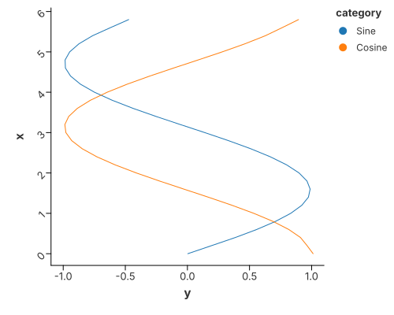
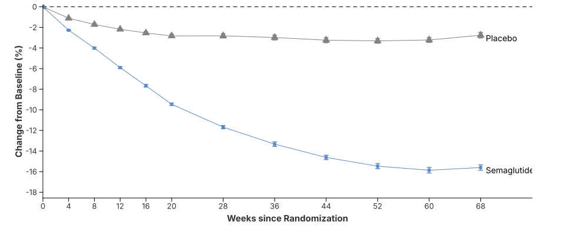
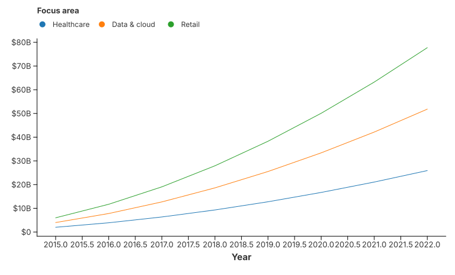

# Line Charts

A line connects the rows of a group in x-order. One group per colour, so a
multi-series line is just `color`.

## Multiple series



Two curves on one axis. `configure_line` also offers smoothing (LOESS) when the
data is noisy.

```rust
{{#include ../../../examples/line.rs}}
```

## Gaps

A missing `x` or `y` breaks the line instead of drawing across it, so an outage
in a time series reads as a gap in the curve. See
[Missing Values & Gaps](../concepts/missing_values.md).

## Cumulative frequency


A running total as a line — the cumulative shape of a distribution without a
histogram.

```rust
{{#include ../../../examples/cumulative_frequency.rs}}
```

## Multi-series with error bars



Lines plus `mark_errorbar` and points, layered with `.and(…)` — the shape of a
published trial figure.

```rust
{{#include ../../../examples/weight_loss_curve.rs}}
```

## Formatted axis labels (Economist style)



Axis labels are a scale concern: `with_y_label_format(...)` renders large values
as `$20B` instead of raw numbers.

```rust
{{#include ../../../examples/label_format.rs}}
```
