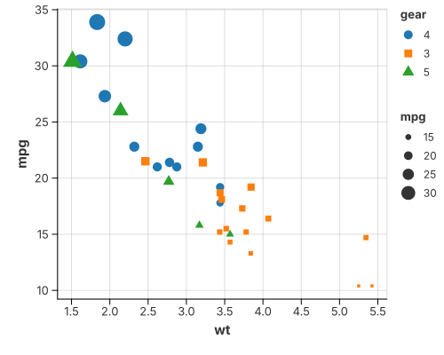

# Scatter

`mark_point` is the base point geometry: shape, size and colour are ordinary
channels, and a layout can spread overlapping observations.

## Shape, size and a reference grid



The grid is a **theme** feature (`with_grid(true)`), not a mark — turn it on for
any chart.

```rust
{{#include ../../../examples/grid_line.rs}}
```

## Point layouts

When points overlap — usually because one axis is categorical — a layout spreads
them **without changing their x position**, so every observation stays visible:

- **Jitter** — small random offsets; good when you only need to break ties.
- **Beeswarm** — deterministic packing, so no two points overlap; best for small
  groups.
- **Quasirandom** — a low-discrepancy sequence that spreads points evenly and
  traces the outline of the distribution; best for large groups.

The layout is a property of the point mark:

```rust
.configure_point(|m| m.with_layout("beeswarm").with_size(1.5))
```

Separately from the layout, a `color` grouping **dodges** points into
side-by-side lanes — but only on a *categorical* x axis, where a lane means
something. On a continuous axis the points stay on their own x, so they line up
with a rule, line or area drawn through them. `with_dodge(false)` turns the lane
off even on a categorical axis, so the colour is an attribute rather than a
group (the [dumbbell](uncertainties_and_trends.md#dumbbell-connected-dot) uses
it).

### Beeswarm


```rust
{{#include ../../../examples/beeswarm.rs}}
```

### Quasirandom


```rust
{{#include ../../../examples/quasirandom.rs}}
```

The quasirandom pairing can be changed with
`with_quasirandom_method("pseudorandom")`.

A **strip / rug** plot is the same idea with `mark_tick` instead of `mark_point`:
see [Strip & Rug Plots](tick_chart.md).

## See also

- [Marks & Geometries](../grammar/marks.md) — the point mark and its layouts.
- [Histogram](histogram.md) and [1-D Density](density_1d.md) — the summarised
  views of the same observations.
