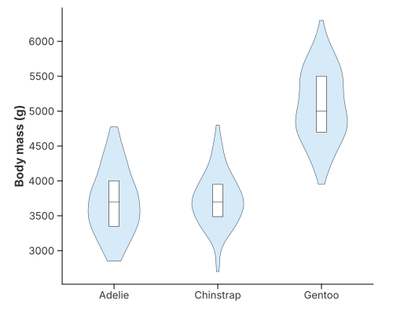
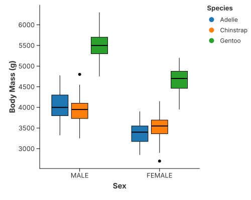
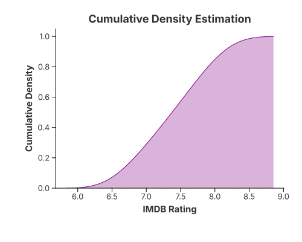
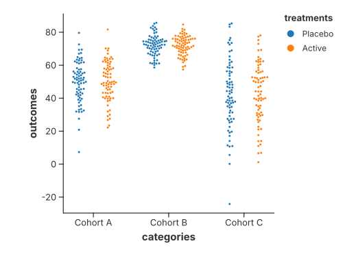
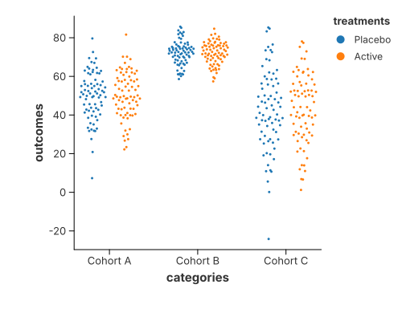

# Statistical Distributions

This chapter shows how to summarise a numeric column. Charton builds these plots
from ordinary parts — see [The Layer Pipeline](../concepts/grammar_pipeline.md)
for the underlying model (data → stat → position → geom).

> Looking for ready-made recipes? The [Violin cookbook page](violin.md) collects
every variant — single, grouped, faceted, split and raincloud — as complete,
compiled examples. This chapter explains the machinery underneath them.

## Violin plot

A violin shows the **density** of a numeric column as a symmetric outline. There
are two idiomatic ways to build one, matching the two industry recipes.

### Reuse the density transform (Vega-Lite / Altair recipe)

For a single or faceted violin, no violin-specific transform is needed. Estimate
the density, draw it as an area, and ask the stack to **mirror** the values
symmetrically around zero — the complete, compiled recipe is on the
[Violin page](violin.md#violin-single), with its
[faceted section](violin.md#grouped-and-faceted-violins).

`"mirror"` is Charton's name for Vega-Lite's `stack: "center"` applied *per
series*: each density curve is drawn from `-density / 2` to `+density / 2`. With
one curve per panel (thanks to the facet) the result is a violin. The single
violin is the same picture without the facet.

### Dodged and split violins (ggplot2 `stat_ydensity` recipe)

A **dodged** violin — several violins side by side inside one category — needs
the *category* on x and a two-field `(category, group)` grouping. That is exactly
what the density transform's multi-field `with_groupbys([...])` provides. The
curve then becomes a polygon through the general band geometry, with a
`Position` deciding the lanes — see
[Grouped and faceted violins](violin.md#grouped-and-faceted-violins) and
[Split violin](violin.md#split-violin) for the compiled recipes.

Both recipes share the same `stats::kde` core, so no statistics are duplicated.
Add `.with_split(true)` to `BandTransform` and the two groups become the two
halves of one violin.

### Tuning the shape

Density (statistics) and band (geometry/placement) are configured separately:

| Method | Meaning |
|---|---|
| `BandTransform::with_scale(BandScale::PerGroup)` | every band has the same maximum width (default) |
| `.with_scale(BandScale::Global)` | bands share one scale, so a denser group looks wider |
| `.with_scale(BandScale::Raw)` | use the width column as it stands |
| `BandTransform::with_width(0.5)` | maximum width of a single band (matches the box plot) |
| `.with_span(0.7)` | total width of a category's group (matches the box plot and point marks) |
| `BandTransform::with_split(true)` | draw two groups as one split violin |
| `DensityTransform::with_bandwidth(BandwidthType::Silverman)` | smoothing rule |
| `.with_kernel(KernelType::Epanechnikov)` | smoothing kernel |

## Inner box and median

`transform_quantile_box` produces the inner inter-quartile box and the median
line as a second polygon layer. It uses the same `Position` lane layout as
`transform_band`, so the box always sits exactly over its violin:



```rust
{{#include ../../../examples/violin_box.rs}}
```

The transform emits a `box_part` column (`"box"` / `"median"`) so the two
polygons can be styled differently if you want.

## Box plot

The box plot is the five-number summary drawn directly. It carries its own
statistics, so no transform is needed:



```rust
{{#include ../../../examples/grouped_boxplot.rs}}
```

## Density plot

The density curve on its own, as a smooth area. Unlike a violin it should fade
out, so the tails are kept (`trim = false`, the default).


```rust
{{#include ../../../examples/density.rs}}
```

## Cumulative density

The same estimator with `.with_cumulative(true)` gives an ECDF-like rising
curve.



```rust
{{#include ../../../examples/distribution.rs}}
```

## Histogram

`mark_hist` bins a numeric column for you; the bin count follows from the data
unless you set `alt::x(...).with_bins(n)`.


```rust
{{#include ../../../examples/histogram.rs}}
```

## Beeswarm and quasirandom

Two point layouts that show every observation without overplotting.




```rust
{{#include ../../../examples/beeswarm.rs}}
```

```rust
{{#include ../../../examples/quasirandom.rs}}
```

## Choosing between violin, box and swarm

* **Box plot** — compact, precise about quartiles, hides the shape.
* **Violin** — shows the shape; good when the distribution is interesting.
* **Beeswarm / strip** — shows every observation; good for small samples.

They combine well: a violin outline with a box, a median line or a swarm layered
on top (a *raincloud*) uses `.and(…)` to stack the layers.
