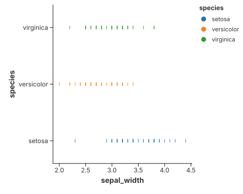
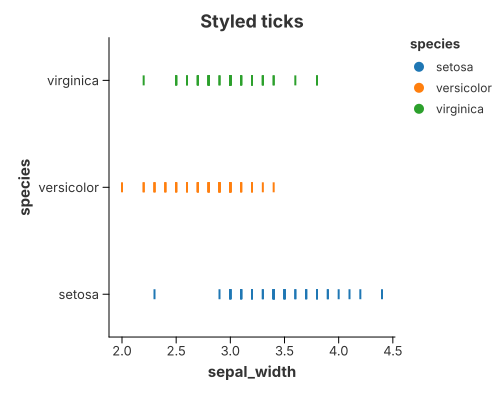

# Strip & Rug Plots

A tick is a short line; many ticks along an axis read as density.

## Strip Plot
The following example uses tick marks to show the distribution of sepal width in the Iris dataset. By adding a y field (categorical data), a strip plot is created to show the distribution of sepal width across different species.

```rust
{{#include ../../../examples/strip.rs}}
```



When there only one category or color encoding is absent, it degeneates to a "rug" of lines along the bottom.

You can precisely control the visual weight of the ticks using configure_tick. This is useful for balancing the "density" look of the chart.



```rust
{{#include ../../../examples/tick_style.rs}}
```

## Significance and Usage
- Significance: Unlike a `point`, a `tick` emphasizes positional density. Because of its linear shape, overlapping ticks create a "barcode" effect that intuitively reveals where data points are most concentrated.

- Common Use Cases:
1. Rug Plots: Often placed at the edges of scatter plots or histograms to show marginal distributions.
2. Strip Plots: Used as an alternative to box plots when the dataset is small to medium-sized, allowing every individual data point to be seen.
3. High-Performance Rendering: In Rust-based engines like `charton`, rendering simple quads (ticks) is extremely efficient for visualizing millions of data points compared to complex shapes.