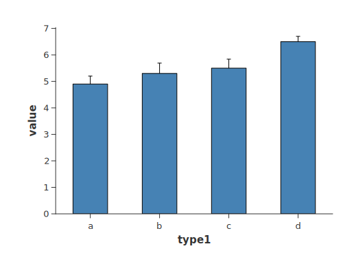
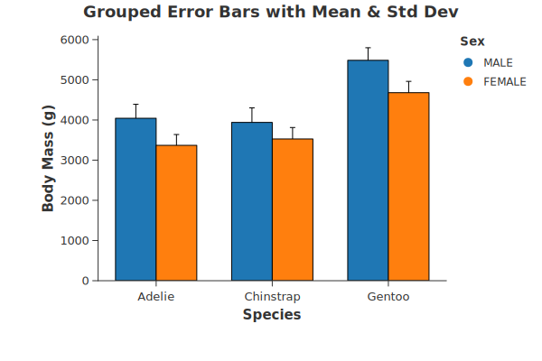

This section explores how to visualize data variability, confidence intervals, and statistical trends. By leveraging Charton's Layered Chart system and Polars expressions, you can easily combine summary statistics (like bars or lines) with their associated error ranges.

### Basic Bar with Error Bars
Error bars are essential for communicating the precision of your data. This example shows the most common use case: a bar chart where each bar is accompanied by a vertical error bar calculated from pre-defined standard deviation values.

**Key Concept:** We use `transform_calculate` to dynamically create `value_min` and `value_max` columns within the chart pipeline.

```rust
{{#include ../../../examples/bar_with_errorbar.rs}}
```



### Grouped Bar with ErrorBar
When multiple groups are present (mapped to `color`), Charton automatically applies "dodge" logic to ensure that both the bars and the error bars are aligned side-by-side for each category.

```rust
{{#include ../../../examples/grouped_bar_with_errorbar_1.rs}}
```



As an alternative approach, we demonstrate how to create a grouped error bar chart by manually defining the error boundaries using `transform_calculate`. While the previous one use automatic statistical aggregations, this method shows that the data generated through Charton's internal transformation pipeline is fully compatible across different layers. By calculating `value_min` and `value_max` within the `errorbar` layer, we ensure that the resulting dataset structure remains consistent with the `mark_bar` layer.

```rust
{{#include ../../../examples/grouped_bar_with_errorbar_2.rs}}
```

