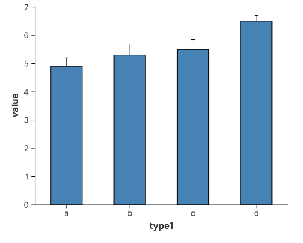
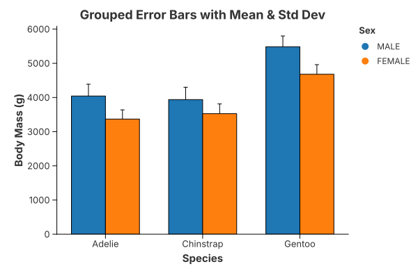
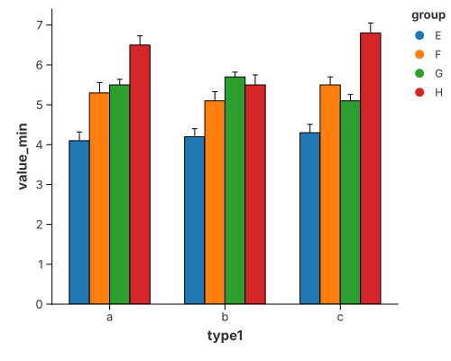
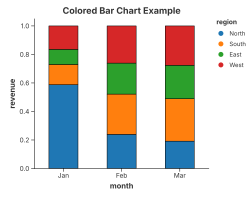
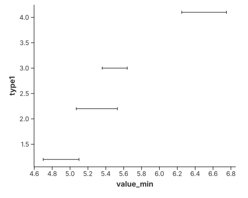
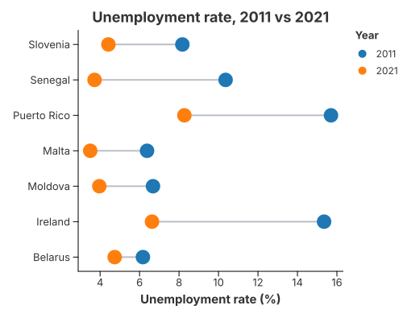
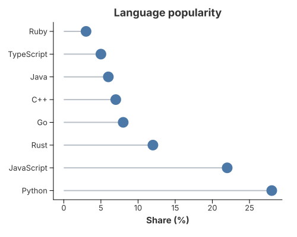
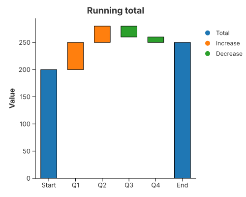
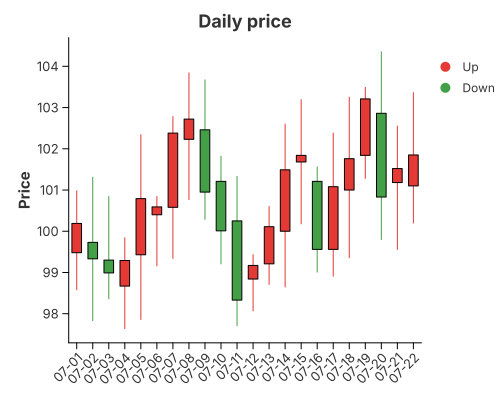

# Bars & Error Bars

This section explores how to visualize data variability, confidence intervals, and statistical trends. By leveraging Charton's Layered Chart system and Polars expressions, you can easily combine summary statistics (like bars or lines) with their associated error ranges.

## Basic Bar with Error Bars
Error bars are essential for communicating the precision of your data. This example shows the most common use case: a bar chart where each bar is accompanied by a vertical error bar calculated from pre-defined standard deviation values.

**Key Concept:** We use `transform_calculate` to dynamically create `value_min` and `value_max` columns within the chart pipeline.

```rust
{{#include ../../../examples/bar_with_errorbar.rs}}
```



## Grouped Bar with ErrorBar
When multiple groups are present (mapped to `color`), Charton automatically applies "dodge" logic to ensure that both the bars and the error bars are aligned side-by-side for each category.

```rust
{{#include ../../../examples/grouped_bar_with_errorbar_1.rs}}
```



As an alternative approach, we demonstrate how to create a grouped error bar chart by manually defining the error boundaries using `transform_calculate`. While the previous one use automatic statistical aggregations, this method shows that the data generated through Charton's internal transformation pipeline is fully compatible across different layers. By calculating `value_min` and `value_max` within the `errorbar` layer, we ensure that the resulting dataset structure remains consistent with the `mark_bar` layer.

```rust
{{#include ../../../examples/grouped_bar_with_errorbar_2.rs}}
```



## Stacked bar



Segments stacked by a colour group; `stack: "stacked"` (the default for a
grouped bar).

```rust
{{#include ../../../examples/stacked_bar.rs}}
```

## Error bar on its own



The interval geometry by itself, without a bar:

```rust
{{#include ../../../examples/errorbar.rs}}
```

## Dumbbell (connected dot)



A **dumbbell** compares two values for each category — a before/after, an A/B, a
min/max. Each row gets a dot at both values and a segment between them: the dot
position shows the level, and the segment length shows how much changed.

It is a recipe, not a mark. `mark_rule` draws the connector from two wide columns
(`y` and `y2`); the dots come from a tidy table so the period can drive the
colour and produce a legend. `coord_flip` stands the categories up so the
segments run horizontally, and `with_dodge(false)` keeps the two ends on the
segment — a colour channel is otherwise a *lane*, which would push the periods
apart into two columns.

```rust
{{#include ../../../examples/dumbbell.rs}}
```

A **lollipop** is the same idea with one end at the baseline; a **range plot**
uses the rule alone.

## Lollipop and range



A bar with the fill thrown away: `mark_rule` draws the stem and `mark_point`
caps it. A **range plot** is the same rule with both ends away from the
baseline, and the dumbbell above is a range plot with two dots.

```rust
{{#include ../../../examples/lollipop.rs}}
```

## Waterfall



A running total as floating bars. `transform_window` with
`WindowOnlyOp::CumulativeSum` carries the total, and a `y2` bound floats each
bar between the total *before* and *after* its step; colour splits increases
from decreases.

```rust
{{#include ../../../examples/waterfall.rs}}
```

## Candlestick



OHLC bars: `mark_rule` draws the high–low wick and a floating `mark_bar` (its
`y2` bound) draws the open–close body, coloured by direction.

```rust
{{#include ../../../examples/candlestick.rs}}
```