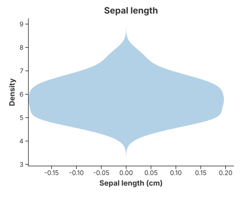
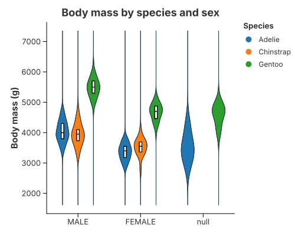
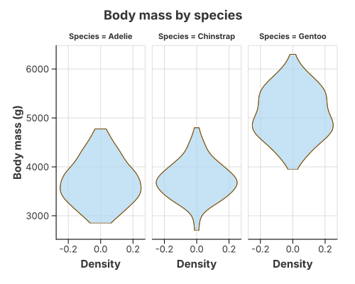
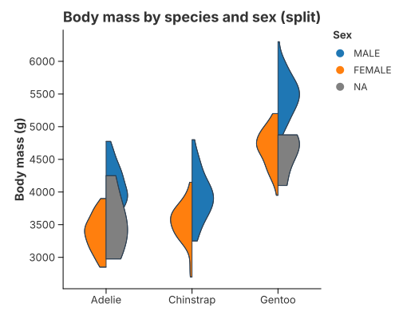
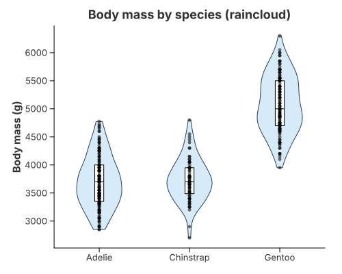

# Violin

A violin shows the **density** of a numeric value as a symmetric outline. There
is no violin mark and no violin-specific transform — it is a short recipe over
the primitives:

```text
transform_density(trim = true)        // one curve per category (and group)
  → a symmetric outline               // mark_area stack "center"/"mirror", or transform_band
  → coord_flip                        // stand the value axis upright
```

Every variant on this page is that same core with **one thing changed**: a
grouping, a facet, a split, or an extra layer. Read the first recipe, then diff
the rest — that is the grammar in action. The curve itself (bandwidth, kernel,
trim) is described in [1-D Density](density_1d.md).

## Violin (single)



Estimate the density, draw it mirrored around zero, and stand the value axis up.

```rust
{{#include ../../../examples/violin.rs}}
```

`"mirror"` is Charton's name for Vega-Lite's `stack: "center"` applied *per
series*: each density curve is drawn from `-density / 2` to `+density / 2`.

## Grouped and faceted violins




Two industry layouts from the same density transform:

- **Faceted** (Vega-Lite / Altair style): draw the mirrored area and let `facet`
  give each group its own panel.
- **Dodged** (ggplot2 style): group the density by `(category, group)`, turn the
  curve into a symmetric `transform_band` polygon, and let a `Position` dodge the
  lanes side by side.

```rust
{{#include ../../../examples/grouped_violin.rs}}
```

When a category used for **position** is missing (the penguins `Sex` column has a
few), that row is dropped, exactly as ggplot2 and Altair would — no `null` violin
appears. A missing **group** (the colour/lane) behaves differently: it is kept as
a grey `NA` lane. See [Missing Values & Gaps](../concepts/missing_values.md).

## Split violin



One centre line per category, the first group growing right and the second left:
`transform_band(…).with_split(true)`. Colour the result by group and the two
halves read as a single violin split down the middle.

```rust
{{#include ../../../examples/split_violin.rs}}
```

## Raincloud



Three views of the same distribution, stacked with `.and(…)`: the violin
outline, an inner inter-quartile box from `transform_quantile_box`, and every
observation as a jittered point layer.

```rust
{{#include ../../../examples/raincloud.rs}}
```

## Tuning band placement

Density (statistics) and band (geometry/placement) are configured separately.
The shape options live in [1-D Density](density_1d.md); these control the lanes:

| Method | Meaning |
|---|---|
| `BandTransform::with_scale(BandScale::PerGroup)` | every band has the same maximum width (default) |
| `.with_scale(BandScale::Global)` | bands share one scale, so a denser group looks wider |
| `.with_scale(BandScale::Raw)` | use the width column as it stands |
| `BandTransform::with_width(0.5)` | maximum width of a single band (matches the box plot) |
| `.with_span(0.7)` | total width of a category's group (matches the box plot and point marks) |
| `BandTransform::with_split(true)` | draw two groups as one split violin |

## Overlaying a box on a dodged violin

`transform_quantile_box` computes the quartiles per `(category, group)` cell, so
any overlay can read them directly. For a dodged (side-by-side) violin, layer it
on top exactly as in the raincloud, but keep the same `Position::dodge()` on the
band and on the box so each box follows its own violin. The box is described in
[Box Plots](box_plot.md).

## Why not a dedicated violin mark?

Every combination above — raincloud, split, overlay, grouped, faceted — would
need bespoke branching inside a single `MarkViolin`. Building from a density stat
plus a polygon instead means:

* the polygon renderer is shared with maps and custom shapes;
* new combinations are new layers, not new renderers;
* every rendering backend (SVG, PNG, PDF, GPU) already knows how to draw the
  parts.

## Choosing a layout

| Variant | Use it when |
| --- | --- |
| Single violin | one distribution |
| Faceted | compare a few groups, each with room to breathe |
| Dodged | compare many groups within one category on a shared axis |
| Split | exactly two groups, to save horizontal space |
| Raincloud | the sample is small enough that showing every point matters |

## See also

- [1-D Density](density_1d.md) — the KDE and its tuning (bandwidth, kernel, trim).
- [Box Plots](box_plot.md) — the inner quantile box and the box-plot mark.
- [Transforms & Columns](../grammar/transforms.md) — which columns each
  transform reads and emits (`density`, `path_group`, `level`, …).
- Primitives: `transform_density`, `transform_band`, `transform_quantile_box`,
  `mark_polygon`, `mark_area` — see [Marks & Geometries](../grammar/marks.md).
