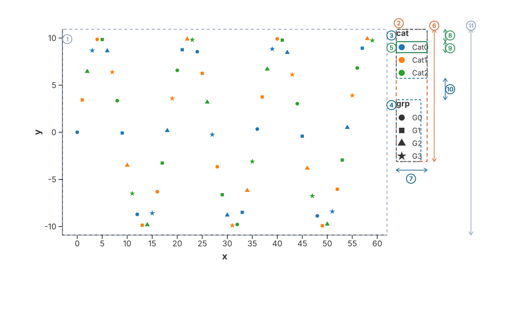

# Guides: Axis & Legends

In a chart, the data marks (points, lines, bars) are the "what," but the Guides are the "how to read it." Guides act as the translation layer between abstract mathematical scales and human-readable visual cues. In Charton, these are primarily categorized into Axes (which interpret spatial mappings) and Legends (which interpret aesthetic mappings).

## The Guide Hierarchy

Following the Grammar of Graphics, Charton treats Axes and Legends as secondary structures that are semantically derived from the primary `Encoding` specification.

* Axes: Provide spatial context. They map the underlying continuous or discrete `Scale` domain to visual ticks and labels along the dimensions of the plotting area.
* Legends: Provide categorical or gradient context. They map aesthetic scales (Color, Shape, Size) back to labeled groups or color ramps.

## Axis Generation: From Math to Ticks

The creation of an axis is a multi-step process triggered during the rendering lifecycle:

1. Tick Calculation: The system queries the `Scale` domain to determine the ideal intervals. For linear data, it uses a "pretty number" algorithm to ensure labels land on clean integers or decimal fractions. For temporal data, it selects sensible units (e.g., hours, days, or months).
2. Physical Positioning: Using the `Coordinate System` (Cartesian or Polar), the axis generator calculates the pixel location for each tick. In Polar systems, this involves converting radial and angular distances into curved labels.
3. Rotation & Collision: If labels are long or dense, the system calculates their physical footprint in pixels. If a conflict occurs, the system dynamically rotates labels (e.g., to 45-degree angles) to avoid overlap, ensuring readability.

## Legend Consolidation: The Semantic Bridge

A major architectural feature in Charton is the Semantic Merging of legends. In many visualization libraries, color, shape, and size legends are generated separately, leading to cluttered interfaces. Charton optimizes this:

- Field Mapping: The system scans all aesthetic mappings (Color, Shape, Size) and groups them by their data `Field` name.
- Unified Guide Specs: If `Color` and `Shape` both map to the same field (e.g., "Category"), the system merges their definitions into a single `GuideSpec`.
- Rendering Strategy: The legend renderer then determines the `GuideKind` (Legend vs. ColorBar):
    - Discrete Legend: Used for categorical data. It builds a list of visual symbols (e.g., colored squares, specific shapes) that represent the group.
    - ColorBar: Used for continuous gradients. It renders a continuous strip that maps the data domain to a visual color ramp.

## Legend Layout Anatomy

A legend is built from two nested levels. The figure below is a real chart -- every box and
marker is drawn at coordinates taken from the layout engine itself, not sketched by hand.



- **① `plot panel`** -- the area the data is drawn in. Everything the legend needs is measured
  against this rectangle, not against the whole canvas.
- **② `strip`** -- the resolved legend plan: the bounding box of every block. Its size is what
  gets reserved as margin around the panel.
- **③ ④ `block`** -- one guide. A block contains its own title *and* all of its entries, so this
  is the box that is packed against the other blocks.
- **⑤ `entry`** -- one row of a legend: the symbol cell, the gap after the symbol, and the label
  text. It contains no spacing towards its neighbours; the packer adds the gaps.
- **⑥ `main`** -- the strip's length along the *packing direction*. A legend on the left or right
  edge is packed vertically, so `main` is a height: 216.4px here.
- **⑦ `cross`** -- the thickness across the packing direction (here the block width, 50.6px). It
  never decides whether something fits; it only decides how far the next column is offset when a
  run wraps.
- **⑧** -- `entry.y` starts at 20.2px rather than 0: a block's coordinates begin at its title, and
  the title strip (13.2px) plus its gap (7px) sit above the first entry.
- **⑨** -- the step between two entries: row 18px + `legend_item_v_gap` 3px.
- **⑩** -- `legend_block_gap` (35px). The second block's offset of 115.2px is the first block's
  height (80.2px) plus this gap.
- **⑪ `budget`** -- how long the strip may become: the panel's extent along the packing direction
  (336.6px here). The strip (⑥) has to stay within it, otherwise the legend spills over the axis
  line and covers the tick labels.

### Two levels, one algorithm

Both levels -- the entries inside a block, and the blocks inside the strip -- are packed by the
same routine, so an offset always means the same thing: *the top-left corner inside my parent*. A
block sits at `strip origin + block offset`, an entry at `block origin + entry offset`, and the
renderer only ever adds those numbers together.

### Wrapping and the cursor

The *cursor* tracks where the next box of the current line begins, which is also how much of the
line is used. A box is placed while its far edge -- `cursor + main` -- stays inside the budget;
otherwise the run wraps and the next line is offset across the packing direction. The new line
starts after the *thickest* box of the previous line, never after its last box, so that a thick
box early in a line cannot be overlapped by the next one:

```text
packing direction ->                      a legend with 30 categories, packed vertically
+------------------------------------+
| cat                                |    column 1 holds entries 0..14;
| ● Category 00   ● Category 15      |    the cursor reached 315px, and adding
| ● Category 01   ● Category 16      |    one more entry (18px) would have passed
| ...             ...                |    the budget of 316.4px, so entry 15
| ● Category 14   ● Category 29      |    starts a new column instead
+------------------------------------+
                    ^
   cross offset of column 2 = column width (93.8) + line gap (15) = 108.8
```

## Layout-Aware Rendering

Guides are not independent objects; they are aware of the chart's total physical constraints.

- **Space Reservation**: The layout engine asks the guides how much room they need and turns that
  into margins around the plot panel. A legend may never be longer than the panel it sits next to;
  that is the rule which keeps a long legend from covering the axis labels.
- **Breaking the cycle**: The three quantities depend on each other -- the panel needs the space
  reserved for the legend and the axes, the axes are measured against the panel, and the legend
  wraps to the panel's length. The engine breaks the cycle by starting from a panel that only
  accounts for the configured margins, then re-measuring until the reservations stop changing.
- **Anchoring**: Guides use a `PanelContext` to position themselves relative to the plot. A legend
  on the `Right` is anchored at the panel's right edge plus the theme margin; one on the `Left` or
  `Top` is additionally offset by the space the axis needs, so it never collides with tick labels.
- **Drawing verbatim**: The resolved plan carries the final position of every block, every entry
  and every gradient bar. Renderers draw those numbers as they are instead of re-deriving them,
  which is what guarantees that the drawn legend matches the space reserved for it.

## Why Consolidation Matters

The automated generation of these guides provides three core advantages:

1. Mathematical Integrity: Because guides are generated directly from the resolved global scales, the labels are guaranteed to match the data precisely. You never have to manually update a label when the data changes.
2. Reduced Visual Noise: By merging multiple aesthetics into a single legend block, the chart keeps the viewer's focus on the data, not on redundant interface elements.
3. Automated Layout: Because the layout manager is aware of guide requirements, you don't need to manually configure margins. The chart automatically adjusts to accommodate the font sizes and number of categories present in your specific dataset.

## Key Takeaways

Axes map space; Legends map aesthetics.

- Guides are derived: They are not manually created, but are inferred directly from the Encoding and Scale specifications.
- Semantic Merging: Multiple aesthetics mapping to the same field are consolidated into a single guide to minimize visual clutter.
- Layout Awareness: Guides communicate their size requirements to the layout engine, ensuring the chart is always self-contained and perfectly padded.